# Eco-Sanjivani Technical Documentation

## Table of Contents

1. [System Architecture Overview](#system-architecture-overview)
2. [Authentication Flow](#authentication-flow)
3. [Database Architecture](#database-architecture)
4. [Component Hierarchy](#component-hierarchy)
5. [Routing Structure](#routing-structure)
6. [Data Flow Patterns](#data-flow-patterns)
7. [AI Waste Classification System](#ai-waste-classification-system)
8. [Event Management System](#event-management-system)
9. [Gamification System](#gamification-system)
10. [Real-time Features](#real-time-features)
11. [Security Implementation](#security-implementation)

---

## System Architecture Overview

### High-Level Architecture

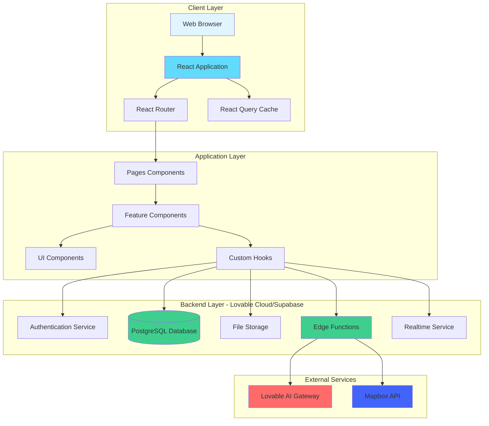
```mermaid
graph TB
    subgraph "Client Layer"
        Browser[Web Browser]
        React[React Application]
        Router[React Router]
        Query[React Query Cache]
    end
    
    subgraph "Application Layer"
        Pages[Pages Components]
        Features[Feature Components]
        UI[UI Components]
        Hooks[Custom Hooks]
    end
    
    subgraph "Backend Layer - Lovable Cloud/Supabase"
        Auth[Authentication Service]
        DB[(PostgreSQL Database)]
        Storage[File Storage]
        EdgeFn[Edge Functions]
        Realtime[Realtime Service]
    end
    
    subgraph "External Services"
        LovableAI[Lovable AI Gateway]
        Mapbox[Mapbox API]
    end
    
    Browser --> React
    React --> Router
    React --> Query
    Router --> Pages
    Pages --> Features
    Features --> UI
    Features --> Hooks
    
    Hooks --> Auth
    Hooks --> DB
    Hooks --> Storage
    Hooks --> EdgeFn
    Hooks --> Realtime
    
    EdgeFn --> LovableAI
    EdgeFn --> Mapbox
    
    style Browser fill:#e1f5ff
    style React fill:#61dafb
    style DB fill:#3ecf8e
    style EdgeFn fill:#3ecf8e
    style LovableAI fill:#ff6b6b
    style Mapbox fill:#4264fb
```

### Technology Stack

| Layer | Technologies |
|-------|-------------|
| **Frontend** | React 18, TypeScript, Vite |
| **Routing** | React Router v6 |
| **State Management** | React Query (TanStack Query) |
| **UI Framework** | Tailwind CSS, Radix UI, shadcn/ui |
| **Backend** | Lovable Cloud (Supabase) |
| **Database** | PostgreSQL with Row Level Security |
| **Authentication** | Supabase Auth |
| **Storage** | Supabase Storage |
| **Serverless** | Deno Edge Functions |
| **AI** | Lovable AI Gateway (Google Gemini 2.5 Flash) |
| **Maps** | Mapbox GL JS |

---

## Authentication Flow

### User Authentication Journey

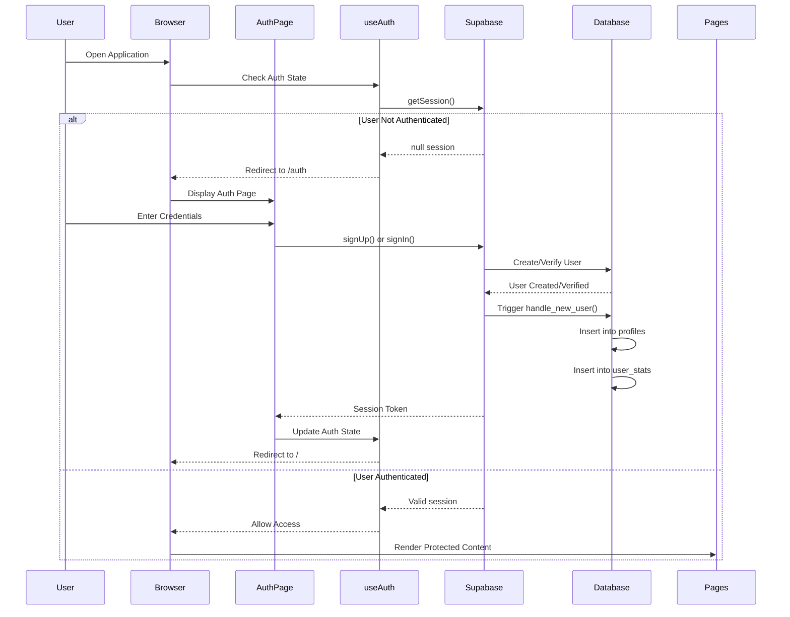
```mermaid
sequenceDiagram
    participant User
    participant Browser
    participant AuthPage
    participant useAuth
    participant Supabase
    participant Database
    
    User->>Browser: Open Application
    Browser->>useAuth: Check Auth State
    useAuth->>Supabase: getSession()
    
    alt User Not Authenticated
        Supabase-->>useAuth: null session
        useAuth-->>Browser: Redirect to /auth
        Browser->>AuthPage: Display Auth Page
        User->>AuthPage: Enter Credentials
        AuthPage->>Supabase: signUp() or signIn()
        Supabase->>Database: Create/Verify User
        Database-->>Supabase: User Created/Verified
        Supabase->>Database: Trigger handle_new_user()
        Database->>Database: Insert into profiles
        Database->>Database: Insert into user_stats
        Supabase-->>AuthPage: Session Token
        AuthPage->>useAuth: Update Auth State
        useAuth-->>Browser: Redirect to /
    else User Authenticated
        Supabase-->>useAuth: Valid session
        useAuth-->>Browser: Allow Access
        Browser->>Pages: Render Protected Content
    end
```

### Authentication Hook Flow

**File: `src/hooks/useAuth.ts`**

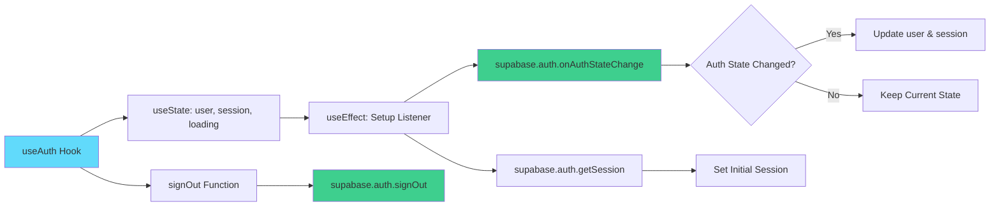
```mermaid
graph LR
    A[useAuth Hook] --> B[useState: user, session, loading]
    B --> C[useEffect: Setup Listener]
    C --> D[supabase.auth.onAuthStateChange]
    D --> E{Auth State Changed?}
    E -->|Yes| F[Update user & session]
    E -->|No| G[Keep Current State]
    C --> H[supabase.auth.getSession]
    H --> I[Set Initial Session]
    A --> J[signOut Function]
    J --> K[supabase.auth.signOut]
    
    style A fill:#61dafb
    style D fill:#3ecf8e
    style K fill:#3ecf8e
```

### Protected Route Implementation

**File: `src/components/ProtectedRoute.tsx`**

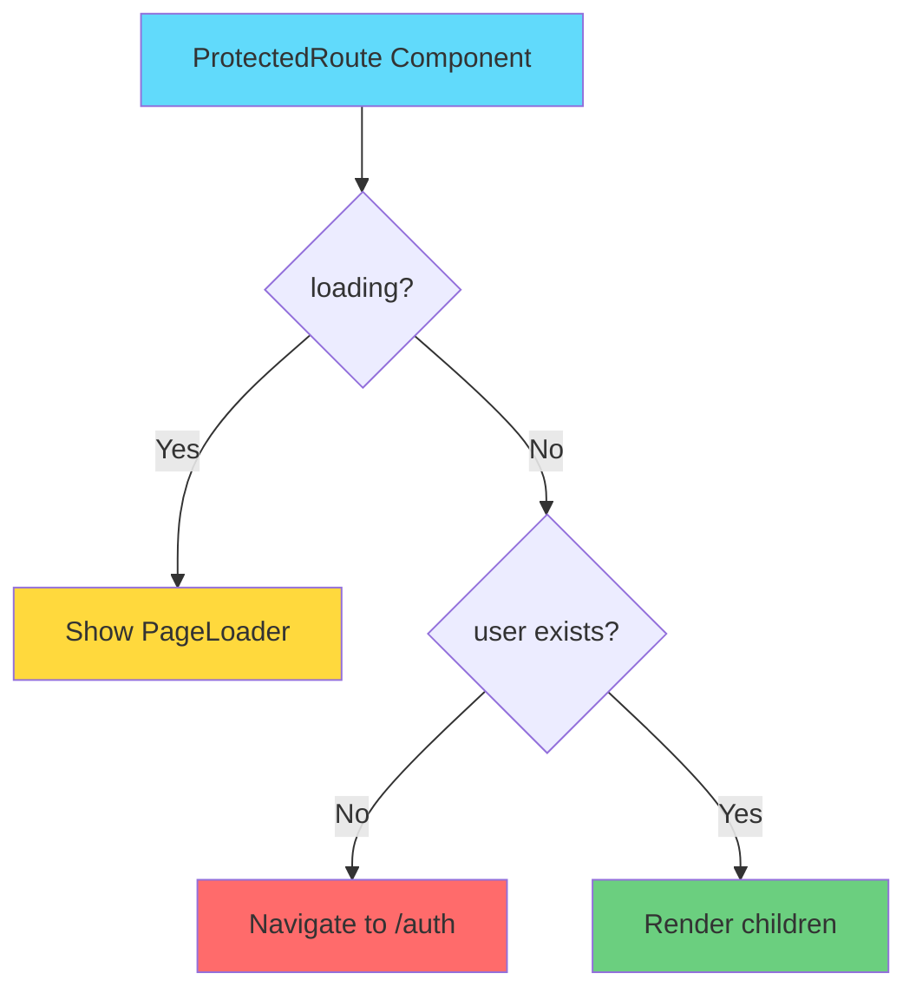
```mermaid
graph TD
    A[ProtectedRoute Component] --> B{loading?}
    B -->|Yes| C[Show PageLoader]
    B -->|No| D{user exists?}
    D -->|No| E[Navigate to /auth]
    D -->|Yes| F[Render children]
    
    style A fill:#61dafb
    style C fill:#ffd93d
    style E fill:#ff6b6b
    style F fill:#6bcf7f
```

---

## Database Architecture

### Complete Database Schema Overview

The Eco-Sanjivani database consists of **13 tables** organized around user management, event coordination, gamification, social features, and waste tracking. All tables use UUID primary keys and include Row Level Security (RLS) for data protection.

### Entity Relationship Diagram

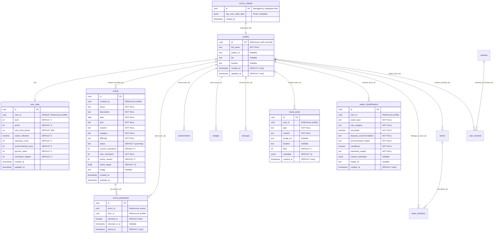
```mermaid
erDiagram
    AUTH_USERS ||--|| profiles : "references (id)"
    profiles ||--|| user_stats : "has"
    profiles ||--o{ events : "creates (created_by)"
    profiles ||--o{ event_participants : "joins (user_id)"
    profiles ||--o{ achievements : "earns (user_id)"
    profiles ||--o{ badges : "earns (user_id)"
    profiles ||--o{ cleanups : "records (user_id)"
    profiles ||--o{ social_posts : "creates (user_id)"
    profiles ||--o{ waste_classifications : "submits (user_id)"
    profiles ||--o{ team_members : "belongs_to (user_id)"
    profiles ||--o{ teams : "creates (created_by)"
    profiles ||--o{ user_rewards : "claims (user_id)"
    
    events ||--o{ event_participants : "has (event_id)"
    teams ||--o{ team_members : "has (team_id)"
    rewards ||--o{ user_rewards : "claimed_by (reward_id)"
    
    AUTH_USERS {
        uuid id PK "Managed by Supabase Auth"
        jsonb raw_user_meta_data "Email, metadata"
        timestamp created_at
    }
    
    profiles {
        uuid id PK "References auth.users(id)"
        text full_name "NOT NULL"
        text avatar_url "Nullable"
        text bio "Nullable"
        text location "Nullable"
        timestamp created_at "DEFAULT now()"
        timestamp updated_at "DEFAULT now()"
    }
    
    user_stats {
        uuid id PK
        uuid user_id "UNIQUE, References profiles"
        int level "DEFAULT 1"
        int points "DEFAULT 0"
        int next_level_points "DEFAULT 500"
        numeric waste_collected "DEFAULT 0"
        int cleanups_count "DEFAULT 0"
        int environmental_score "DEFAULT 0"
        int quizzes_taken "DEFAULT 0"
        int volunteers_helped "DEFAULT 0"
        timestamp created_at
        timestamp updated_at
    }
    
    events {
        uuid id PK
        uuid created_by "References profiles"
        text name "NOT NULL"
        text description "NOT NULL"
        date date "NOT NULL"
        text time "NOT NULL"
        text location "NOT NULL"
        text category "NOT NULL"
        text difficulty "NOT NULL"
        text status "DEFAULT 'upcoming'"
        int current_volunteers "DEFAULT 0"
        int max_volunteers "NOT NULL"
        int points_reward "DEFAULT 0"
        text[] waste_target "DEFAULT '{}'"
        text image "Nullable"
        timestamp created_at
        timestamp updated_at
    }
    
    event_participants {
        uuid id PK
        uuid event_id "References events"
        uuid user_id "References profiles"
        boolean checked_in "DEFAULT false"
        timestamp checked_in_at "Nullable"
        timestamp joined_at "DEFAULT now()"
    }
    
    social_posts {
        uuid id PK
        uuid user_id "References profiles"
        text type "NOT NULL"
        text content "NOT NULL"
        text image_url "Nullable"
        text location "Nullable"
        int likes "DEFAULT 0"
        jsonb metadata "DEFAULT '{}'"
        timestamp created_at "DEFAULT now()"
    }
    
    waste_classifications {
        uuid id PK
        uuid user_id "References profiles"
        text waste_type "NOT NULL"
        text sub_category "NOT NULL"
        boolean recyclable "NOT NULL"
        text disposal_recommendation "NOT NULL"
        text environmental_impact "NOT NULL"
        numeric confidence "NOT NULL"
        text estimated_weight "NOT NULL"
        jsonb volume_estimation "Nullable"
        text image_url "Nullable"
        timestamp created_at "DEFAULT now()"
    }
```

---

## Complete Table Schemas

### 1. profiles Table

**Purpose**: Stores user profile information linked to Supabase Auth users.

```sql
CREATE TABLE public.profiles (
  id uuid NOT NULL REFERENCES auth.users(id) ON DELETE CASCADE,
  full_name text NOT NULL,
  avatar_url text,
  bio text,
  location text,
  created_at timestamp with time zone NOT NULL DEFAULT now(),
  updated_at timestamp with time zone NOT NULL DEFAULT now(),
  PRIMARY KEY (id)
);

ALTER TABLE public.profiles ENABLE ROW LEVEL SECURITY;
```

**Columns:**
| Column | Type | Nullable | Default | Description |
|--------|------|----------|---------|-------------|
| `id` | uuid | NO | - | Primary key, references auth.users |
| `full_name` | text | NO | - | User's display name |
| `avatar_url` | text | YES | NULL | URL to user's avatar image |
| `bio` | text | YES | NULL | User biography/description |
| `location` | text | YES | NULL | User's location |
| `created_at` | timestamp | NO | now() | Profile creation timestamp |
| `updated_at` | timestamp | NO | now() | Last update timestamp |

**RLS Policies:**
- ✅ **SELECT**: Everyone can view profiles (public profiles)
- ✅ **INSERT**: Users can create their own profile (auth.uid() = id)
- ✅ **UPDATE**: Users can update their own profile (auth.uid() = id)
- ❌ **DELETE**: No deletion allowed (cascade from auth.users)

**Triggers:**
- `update_profiles_updated_at`: Updates `updated_at` on row modification

---

### 2. user_stats Table

**Purpose**: Tracks user gamification statistics, points, levels, and achievements.

```sql
CREATE TABLE public.user_stats (
  id uuid NOT NULL DEFAULT gen_random_uuid(),
  user_id uuid NOT NULL REFERENCES profiles(id) ON DELETE CASCADE,
  level integer NOT NULL DEFAULT 1,
  points integer NOT NULL DEFAULT 0,
  next_level_points integer NOT NULL DEFAULT 500,
  waste_collected numeric NOT NULL DEFAULT 0,
  cleanups_count integer NOT NULL DEFAULT 0,
  environmental_score integer NOT NULL DEFAULT 0,
  quizzes_taken integer NOT NULL DEFAULT 0,
  volunteers_helped integer NOT NULL DEFAULT 0,
  created_at timestamp with time zone NOT NULL DEFAULT now(),
  updated_at timestamp with time zone NOT NULL DEFAULT now(),
  PRIMARY KEY (id),
  UNIQUE (user_id)
);

ALTER TABLE public.user_stats ENABLE ROW LEVEL SECURITY;
```

**Columns:**
| Column | Type | Nullable | Default | Description |
|--------|------|----------|---------|-------------|
| `id` | uuid | NO | gen_random_uuid() | Primary key |
| `user_id` | uuid | NO | - | References profiles (UNIQUE) |
| `level` | integer | NO | 1 | User's current level |
| `points` | integer | NO | 0 | Total points earned |
| `next_level_points` | integer | NO | 500 | Points needed for next level |
| `waste_collected` | numeric | NO | 0 | Total waste collected (kg) |
| `cleanups_count` | integer | NO | 0 | Number of cleanups participated |
| `environmental_score` | integer | NO | 0 | Environmental impact score |
| `quizzes_taken` | integer | NO | 0 | Number of quizzes completed |
| `volunteers_helped` | integer | NO | 0 | Number of volunteers recruited |
| `created_at` | timestamp | NO | now() | Record creation timestamp |
| `updated_at` | timestamp | NO | now() | Last update timestamp |

**RLS Policies:**
- ✅ **SELECT**: Everyone can view stats (for leaderboards)
- ✅ **INSERT**: Users can create their own stats (auth.uid() = user_id)
- ✅ **UPDATE**: Users can update their own stats (auth.uid() = user_id)
- ❌ **DELETE**: No deletion allowed (data integrity)

---

### 3. events Table

**Purpose**: Stores cleanup events, campaigns, and environmental activities.

```sql
CREATE TABLE public.events (
  id uuid NOT NULL DEFAULT gen_random_uuid(),
  created_by uuid NOT NULL REFERENCES profiles(id) ON DELETE CASCADE,
  name text NOT NULL,
  description text NOT NULL,
  date date NOT NULL,
  time text NOT NULL,
  location text NOT NULL,
  category text NOT NULL,
  difficulty text NOT NULL,
  status text NOT NULL DEFAULT 'upcoming',
  current_volunteers integer NOT NULL DEFAULT 0,
  max_volunteers integer NOT NULL,
  points_reward integer NOT NULL DEFAULT 0,
  waste_target text[] NOT NULL DEFAULT '{}',
  image text,
  created_at timestamp with time zone NOT NULL DEFAULT now(),
  updated_at timestamp with time zone NOT NULL DEFAULT now(),
  PRIMARY KEY (id)
);

ALTER TABLE public.events ENABLE ROW LEVEL SECURITY;
```

**Columns:**
| Column | Type | Nullable | Default | Description |
|--------|------|----------|---------|-------------|
| `id` | uuid | NO | gen_random_uuid() | Primary key |
| `created_by` | uuid | NO | - | References profiles (event creator) |
| `name` | text | NO | - | Event name/title |
| `description` | text | NO | - | Event description |
| `date` | date | NO | - | Event date |
| `time` | text | NO | - | Event time (formatted string) |
| `location` | text | NO | - | Event location |
| `category` | text | NO | - | beach, river, park, etc. |
| `difficulty` | text | NO | - | easy, medium, hard |
| `status` | text | NO | 'upcoming' | upcoming, in_progress, completed, cancelled |
| `current_volunteers` | integer | NO | 0 | Number of registered volunteers |
| `max_volunteers` | integer | NO | - | Maximum volunteer capacity |
| `points_reward` | integer | NO | 0 | Points awarded for participation |
| `waste_target` | text[] | NO | '{}' | Types of waste targeted |
| `image` | text | YES | NULL | Event banner image URL |
| `created_at` | timestamp | NO | now() | Event creation timestamp |
| `updated_at` | timestamp | NO | now() | Last update timestamp |

**RLS Policies:**
- ✅ **SELECT**: Authenticated users can view all events
- ✅ **INSERT**: Authenticated users can create events (auth.uid() = created_by)
- ✅ **UPDATE**: Event creators can update (auth.uid() = created_by)
- ✅ **DELETE**: Event creators can delete (auth.uid() = created_by)

---

### 4. event_participants Table

**Purpose**: Junction table linking users to events they've joined.

```sql
CREATE TABLE public.event_participants (
  id uuid NOT NULL DEFAULT gen_random_uuid(),
  event_id uuid NOT NULL REFERENCES events(id) ON DELETE CASCADE,
  user_id uuid NOT NULL REFERENCES profiles(id) ON DELETE CASCADE,
  checked_in boolean NOT NULL DEFAULT false,
  checked_in_at timestamp with time zone,
  joined_at timestamp with time zone NOT NULL DEFAULT now(),
  PRIMARY KEY (id),
  UNIQUE (event_id, user_id)
);

ALTER TABLE public.event_participants ENABLE ROW LEVEL SECURITY;
```

**Columns:**
| Column | Type | Nullable | Default | Description |
|--------|------|----------|---------|-------------|
| `id` | uuid | NO | gen_random_uuid() | Primary key |
| `event_id` | uuid | NO | - | References events |
| `user_id` | uuid | NO | - | References profiles |
| `checked_in` | boolean | NO | false | Whether user checked in at event |
| `checked_in_at` | timestamp | YES | NULL | Check-in timestamp |
| `joined_at` | timestamp | NO | now() | Registration timestamp |

**Constraints:**
- UNIQUE constraint on (event_id, user_id) - prevents duplicate registrations

**RLS Policies:**
- ✅ **SELECT**: Authenticated users can view participants
- ✅ **INSERT**: Users can join events (auth.uid() = user_id)
- ✅ **UPDATE**: Users can update their participation (auth.uid() = user_id)
- ✅ **DELETE**: Users can leave events (auth.uid() = user_id)

---

### 5. achievements Table

**Purpose**: Tracks user achievements and milestone progress.

```sql
CREATE TABLE public.achievements (
  id uuid NOT NULL DEFAULT gen_random_uuid(),
  user_id uuid NOT NULL REFERENCES profiles(id) ON DELETE CASCADE,
  name text NOT NULL,
  description text NOT NULL,
  progress numeric,
  earned boolean NOT NULL DEFAULT false,
  earned_at timestamp with time zone,
  created_at timestamp with time zone NOT NULL DEFAULT now(),
  PRIMARY KEY (id)
);

ALTER TABLE public.achievements ENABLE ROW LEVEL SECURITY;
```

**Columns:**
| Column | Type | Nullable | Default | Description |
|--------|------|----------|---------|-------------|
| `id` | uuid | NO | gen_random_uuid() | Primary key |
| `user_id` | uuid | NO | - | References profiles |
| `name` | text | NO | - | Achievement name |
| `description` | text | NO | - | Achievement description |
| `progress` | numeric | YES | NULL | Progress percentage (0-100) |
| `earned` | boolean | NO | false | Whether achievement is completed |
| `earned_at` | timestamp | YES | NULL | Completion timestamp |
| `created_at` | timestamp | NO | now() | Record creation timestamp |

**RLS Policies:**
- ✅ **SELECT**: Everyone can view achievements (public profiles)
- ✅ **INSERT**: Users can create their achievements (auth.uid() = user_id)
- ✅ **UPDATE**: Users can update their achievements (auth.uid() = user_id)
- ❌ **DELETE**: No deletion allowed (achievement history)

---

### 6. badges Table

**Purpose**: Stores earned badges for user accomplishments.

```sql
CREATE TABLE public.badges (
  id uuid NOT NULL DEFAULT gen_random_uuid(),
  user_id uuid NOT NULL REFERENCES profiles(id) ON DELETE CASCADE,
  name text NOT NULL,
  earned_at timestamp with time zone NOT NULL DEFAULT now(),
  PRIMARY KEY (id)
);

ALTER TABLE public.badges ENABLE ROW LEVEL SECURITY;
```

**Columns:**
| Column | Type | Nullable | Default | Description |
|--------|------|----------|---------|-------------|
| `id` | uuid | NO | gen_random_uuid() | Primary key |
| `user_id` | uuid | NO | - | References profiles |
| `name` | text | NO | - | Badge name/type |
| `earned_at` | timestamp | NO | now() | Badge earned timestamp |

**RLS Policies:**
- ✅ **SELECT**: Everyone can view badges (public profiles)
- ✅ **INSERT**: Users can earn badges (auth.uid() = user_id)
- ❌ **UPDATE**: No updates allowed (immutable records)
- ❌ **DELETE**: No deletion allowed (badge history)

---

### 7. cleanups Table

**Purpose**: Records individual cleanup activities and their impact.

```sql
CREATE TABLE public.cleanups (
  id uuid NOT NULL DEFAULT gen_random_uuid(),
  user_id uuid NOT NULL REFERENCES profiles(id) ON DELETE CASCADE,
  name text NOT NULL,
  location text NOT NULL,
  date timestamp with time zone NOT NULL,
  waste_collected numeric NOT NULL,
  points_earned integer NOT NULL,
  created_at timestamp with time zone NOT NULL DEFAULT now(),
  PRIMARY KEY (id)
);

ALTER TABLE public.cleanups ENABLE ROW LEVEL SECURITY;
```

**Columns:**
| Column | Type | Nullable | Default | Description |
|--------|------|----------|---------|-------------|
| `id` | uuid | NO | gen_random_uuid() | Primary key |
| `user_id` | uuid | NO | - | References profiles |
| `name` | text | NO | - | Cleanup activity name |
| `location` | text | NO | - | Cleanup location |
| `date` | timestamp | NO | - | Cleanup date/time |
| `waste_collected` | numeric | NO | - | Amount of waste (kg) |
| `points_earned` | integer | NO | - | Points awarded |
| `created_at` | timestamp | NO | now() | Record creation timestamp |

**RLS Policies:**
- ✅ **SELECT**: Everyone can view cleanups
- ✅ **INSERT**: Users can record cleanups (auth.uid() = user_id)
- ❌ **UPDATE**: No updates allowed (data integrity)
- ❌ **DELETE**: No deletion allowed (historical record)

---

### 8. social_posts Table

**Purpose**: Stores user-generated social content and updates.

```sql
CREATE TABLE public.social_posts (
  id uuid NOT NULL DEFAULT gen_random_uuid(),
  user_id uuid NOT NULL REFERENCES profiles(id) ON DELETE CASCADE,
  type text NOT NULL,
  content text NOT NULL,
  image_url text,
  location text,
  likes integer NOT NULL DEFAULT 0,
  metadata jsonb DEFAULT '{}'::jsonb,
  created_at timestamp with time zone NOT NULL DEFAULT now(),
  PRIMARY KEY (id)
);

ALTER TABLE public.social_posts ENABLE ROW LEVEL SECURITY;
```

**Columns:**
| Column | Type | Nullable | Default | Description |
|--------|------|----------|---------|-------------|
| `id` | uuid | NO | gen_random_uuid() | Primary key |
| `user_id` | uuid | NO | - | References profiles |
| `type` | text | NO | - | Post type (achievement, photo, update) |
| `content` | text | NO | - | Post content/caption |
| `image_url` | text | YES | NULL | Associated image URL |
| `location` | text | YES | NULL | Location tag |
| `likes` | integer | NO | 0 | Number of likes |
| `metadata` | jsonb | YES | '{}' | Additional post metadata |
| `created_at` | timestamp | NO | now() | Post creation timestamp |

**RLS Policies:**
- ✅ **SELECT**: Authenticated users can view posts
- ✅ **INSERT**: Users can create posts (auth.uid() = user_id)
- ✅ **UPDATE**: Users can update their posts (auth.uid() = user_id)
- ✅ **DELETE**: Users can delete their posts (auth.uid() = user_id)

---

### 9. waste_classifications Table

**Purpose**: Stores AI-classified waste images and analysis results.

```sql
CREATE TABLE public.waste_classifications (
  id uuid NOT NULL DEFAULT gen_random_uuid(),
  user_id uuid NOT NULL REFERENCES profiles(id) ON DELETE CASCADE,
  waste_type text NOT NULL,
  sub_category text NOT NULL,
  recyclable boolean NOT NULL,
  disposal_recommendation text NOT NULL,
  environmental_impact text NOT NULL,
  confidence numeric NOT NULL,
  estimated_weight text NOT NULL,
  volume_estimation jsonb,
  image_url text,
  created_at timestamp with time zone NOT NULL DEFAULT now(),
  PRIMARY KEY (id)
);

ALTER TABLE public.waste_classifications ENABLE ROW LEVEL SECURITY;
```

**Columns:**
| Column | Type | Nullable | Default | Description |
|--------|------|----------|---------|-------------|
| `id` | uuid | NO | gen_random_uuid() | Primary key |
| `user_id` | uuid | NO | - | References profiles |
| `waste_type` | text | NO | - | Main waste category |
| `sub_category` | text | NO | - | Specific waste sub-type |
| `recyclable` | boolean | NO | - | Whether waste is recyclable |
| `disposal_recommendation` | text | NO | - | How to dispose properly |
| `environmental_impact` | text | NO | - | Impact assessment |
| `confidence` | numeric | NO | - | AI confidence (0-1) |
| `estimated_weight` | text | NO | - | Estimated weight range |
| `volume_estimation` | jsonb | YES | NULL | Volume calculation details |
| `image_url` | text | YES | NULL | Classified image URL |
| `created_at` | timestamp | NO | now() | Classification timestamp |

**RLS Policies:**
- ✅ **SELECT**: Users can view their own classifications (auth.uid() = user_id)
- ✅ **INSERT**: Users can create classifications (auth.uid() = user_id)
- ❌ **UPDATE**: No updates allowed (historical record)
- ✅ **DELETE**: Users can delete their classifications (auth.uid() = user_id)

---

### 10. teams Table

**Purpose**: Stores team/group information for collaborative activities.

```sql
CREATE TABLE public.teams (
  id uuid NOT NULL DEFAULT gen_random_uuid(),
  created_by uuid NOT NULL REFERENCES profiles(id) ON DELETE CASCADE,
  name text NOT NULL,
  description text,
  location text,
  is_public boolean NOT NULL DEFAULT true,
  member_limit integer,
  created_at timestamp with time zone NOT NULL DEFAULT now(),
  PRIMARY KEY (id)
);

ALTER TABLE public.teams ENABLE ROW LEVEL SECURITY;
```

**Columns:**
| Column | Type | Nullable | Default | Description |
|--------|------|----------|---------|-------------|
| `id` | uuid | NO | gen_random_uuid() | Primary key |
| `created_by` | uuid | NO | - | References profiles (team creator) |
| `name` | text | NO | - | Team name |
| `description` | text | YES | NULL | Team description |
| `location` | text | YES | NULL | Team base location |
| `is_public` | boolean | NO | true | Whether team is publicly visible |
| `member_limit` | integer | YES | NULL | Maximum team size |
| `created_at` | timestamp | NO | now() | Team creation timestamp |

**RLS Policies:**
- ✅ **SELECT**: Everyone can view teams
- ✅ **INSERT**: Users can create teams (auth.uid() = created_by)
- ❌ **UPDATE**: No updates currently allowed
- ❌ **DELETE**: No deletion currently allowed

---

### 11. team_members Table

**Purpose**: Junction table linking users to teams.

```sql
CREATE TABLE public.team_members (
  id uuid NOT NULL DEFAULT gen_random_uuid(),
  team_id uuid NOT NULL REFERENCES teams(id) ON DELETE CASCADE,
  user_id uuid NOT NULL REFERENCES profiles(id) ON DELETE CASCADE,
  role text NOT NULL DEFAULT 'member',
  joined_at timestamp with time zone NOT NULL DEFAULT now(),
  PRIMARY KEY (id),
  UNIQUE (team_id, user_id)
);

ALTER TABLE public.team_members ENABLE ROW LEVEL SECURITY;
```

**Columns:**
| Column | Type | Nullable | Default | Description |
|--------|------|----------|---------|-------------|
| `id` | uuid | NO | gen_random_uuid() | Primary key |
| `team_id` | uuid | NO | - | References teams |
| `user_id` | uuid | NO | - | References profiles |
| `role` | text | NO | 'member' | Member role (member, admin, leader) |
| `joined_at` | timestamp | NO | now() | Join timestamp |

**Constraints:**
- UNIQUE constraint on (team_id, user_id) - prevents duplicate memberships

**RLS Policies:**
- ✅ **SELECT**: Everyone can view team members
- ✅ **INSERT**: Users can join teams (auth.uid() = user_id)
- ❌ **UPDATE**: No updates currently allowed
- ❌ **DELETE**: No deletion currently allowed

---

### 12. rewards Table

**Purpose**: Catalog of available rewards for redemption.

```sql
CREATE TABLE public.rewards (
  id uuid NOT NULL DEFAULT gen_random_uuid(),
  name text NOT NULL,
  description text NOT NULL,
  category text NOT NULL,
  points_cost integer NOT NULL,
  available boolean NOT NULL DEFAULT true,
  icon text,
  created_at timestamp with time zone NOT NULL DEFAULT now(),
  PRIMARY KEY (id)
);

ALTER TABLE public.rewards ENABLE ROW LEVEL SECURITY;
```

**Columns:**
| Column | Type | Nullable | Default | Description |
|--------|------|----------|---------|-------------|
| `id` | uuid | NO | gen_random_uuid() | Primary key |
| `name` | text | NO | - | Reward name |
| `description` | text | NO | - | Reward description |
| `category` | text | NO | - | Reward category |
| `points_cost` | integer | NO | - | Points required to claim |
| `available` | boolean | NO | true | Whether reward is available |
| `icon` | text | YES | NULL | Reward icon identifier |
| `created_at` | timestamp | NO | now() | Reward creation timestamp |

**RLS Policies:**
- ✅ **SELECT**: Authenticated users can view rewards
- ❌ **INSERT**: No user insertions (admin-managed)
- ❌ **UPDATE**: No user updates (admin-managed)
- ❌ **DELETE**: No user deletions (admin-managed)

---

### 13. user_rewards Table

**Purpose**: Tracks rewards claimed by users.

```sql
CREATE TABLE public.user_rewards (
  id uuid NOT NULL DEFAULT gen_random_uuid(),
  user_id uuid NOT NULL REFERENCES profiles(id) ON DELETE CASCADE,
  reward_id uuid NOT NULL REFERENCES rewards(id) ON DELETE CASCADE,
  claimed_at timestamp with time zone NOT NULL DEFAULT now(),
  PRIMARY KEY (id)
);

ALTER TABLE public.user_rewards ENABLE ROW LEVEL SECURITY;
```

**Columns:**
| Column | Type | Nullable | Default | Description |
|--------|------|----------|---------|-------------|
| `id` | uuid | NO | gen_random_uuid() | Primary key |
| `user_id` | uuid | NO | - | References profiles |
| `reward_id` | uuid | NO | - | References rewards |
| `claimed_at` | timestamp | NO | now() | Claim timestamp |

**RLS Policies:**
- ✅ **SELECT**: Users can view their claimed rewards (auth.uid() = user_id)
- ✅ **INSERT**: Users can claim rewards (auth.uid() = user_id)
- ❌ **UPDATE**: No updates allowed (immutable records)
- ❌ **DELETE**: No deletion allowed (claim history)

---

## Database Functions

### 1. handle_new_user()

**Purpose**: Automatically creates profile and stats when a user signs up.

```sql
CREATE OR REPLACE FUNCTION public.handle_new_user()
RETURNS trigger
LANGUAGE plpgsql
SECURITY DEFINER
SET search_path TO 'public'
AS $function$
BEGIN
  -- Insert profile with user metadata
  INSERT INTO public.profiles (id, full_name)
  VALUES (
    NEW.id, 
    COALESCE(NEW.raw_user_meta_data->>'full_name', 'New User')
  );
  
  -- Insert initial stats with default values
  INSERT INTO public.user_stats (user_id)
  VALUES (NEW.id);
  
  RETURN NEW;
END;
$function$;
```

**Trigger:**
```sql
CREATE TRIGGER on_auth_user_created
  AFTER INSERT ON auth.users
  FOR EACH ROW
  EXECUTE FUNCTION public.handle_new_user();
```

**Flow:**
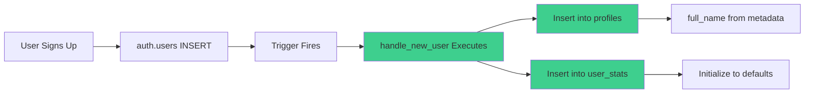
```mermaid
graph LR
    A[User Signs Up] --> B[auth.users INSERT]
    B --> C[Trigger Fires]
    C --> D[handle_new_user Executes]
    D --> E[Insert into profiles]
    E --> F[full_name from metadata]
    D --> G[Insert into user_stats]
    G --> H[Initialize to defaults]
    
    style D fill:#3ecf8e
    style E fill:#3ecf8e
    style G fill:#3ecf8e
```

**Key Features:**
- **SECURITY DEFINER**: Runs with elevated privileges to bypass RLS
- **Atomic**: Both inserts succeed or both fail
- **Metadata Extraction**: Pulls full_name from sign-up metadata
- **Default Values**: Initializes stats to zero

---

### 2. update_updated_at_column()

**Purpose**: Automatically updates the `updated_at` timestamp on row modifications.

```sql
CREATE OR REPLACE FUNCTION public.update_updated_at_column()
RETURNS trigger
LANGUAGE plpgsql
AS $function$
BEGIN
  NEW.updated_at = now();
  RETURN NEW;
END;
$function$;
```

**Applied to Tables:**
- `profiles`
- `user_stats`
- `events`

**Trigger Example:**
```sql
CREATE TRIGGER update_profiles_updated_at
  BEFORE UPDATE ON public.profiles
  FOR EACH ROW
  EXECUTE FUNCTION public.update_updated_at_column();
```

**Flow:**
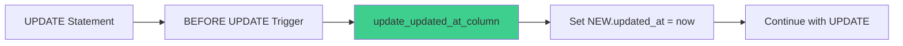
```mermaid
graph LR
    A[UPDATE Statement] --> B[BEFORE UPDATE Trigger]
    B --> C[update_updated_at_column]
    C --> D[Set NEW.updated_at = now]
    D --> E[Continue with UPDATE]
    
    style C fill:#3ecf8e
```

---

## Row Level Security (RLS) Policies - Detailed

### Security Model Overview

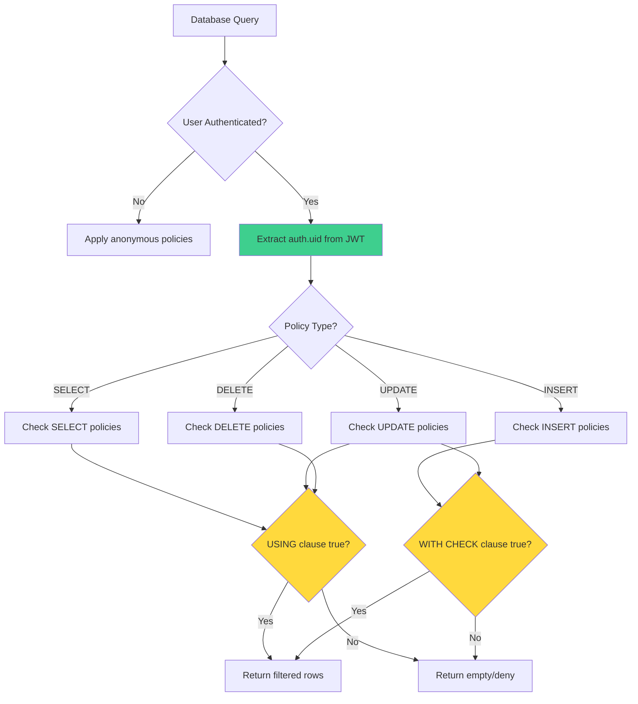
```mermaid
graph TD
    A[Database Query] --> B{User Authenticated?}
    B -->|No| C[Apply anonymous policies]
    B -->|Yes| D[Extract auth.uid from JWT]
    
    D --> E{Policy Type?}
    E -->|SELECT| F[Check SELECT policies]
    E -->|INSERT| G[Check INSERT policies]
    E -->|UPDATE| H[Check UPDATE policies]
    E -->|DELETE| I[Check DELETE policies]
    
    F --> J{USING clause true?}
    G --> K{WITH CHECK clause true?}
    H --> J
    H --> K
    I --> J
    
    J -->|Yes| L[Return filtered rows]
    J -->|No| M[Return empty/deny]
    K -->|Yes| L
    K -->|No| M
    
    style D fill:#3ecf8e
    style J fill:#ffd93d
    style K fill:#ffd93d
```

### Detailed RLS Policy Table

| Table | Policy Name | Command | Using Expression | With Check Expression |
|-------|------------|---------|-----------------|---------------------|
| **profiles** | Public profiles viewable | SELECT | `true` | - |
| | Users can insert own profile | INSERT | - | `auth.uid() = id` |
| | Users can update own profile | UPDATE | `auth.uid() = id` | - |
| **user_stats** | Stats viewable by everyone | SELECT | `true` | - |
| | Users can insert own stats | INSERT | - | `auth.uid() = user_id` |
| | Users can update own stats | UPDATE | `auth.uid() = user_id` | - |
| **events** | Events viewable by authenticated | SELECT | `auth.uid() IS NOT NULL` | - |
| | Users can create events | INSERT | - | `auth.uid() = created_by` |
| | Creators can update events | UPDATE | `auth.uid() = created_by` | - |
| | Creators can delete events | DELETE | `auth.uid() = created_by` | - |
| **event_participants** | Participants viewable | SELECT | `auth.uid() IS NOT NULL` | - |
| | Users can join events | INSERT | - | `auth.uid() = user_id` |
| | Users update participation | UPDATE | `auth.uid() = user_id` | - |
| | Users can leave events | DELETE | `auth.uid() = user_id` | - |
| **achievements** | Achievements viewable | SELECT | `true` | - |
| | Users insert achievements | INSERT | - | `auth.uid() = user_id` |
| | Users update achievements | UPDATE | `auth.uid() = user_id` | - |
| **badges** | Badges viewable | SELECT | `true` | - |
| | Users can earn badges | INSERT | - | `auth.uid() = user_id` |
| **social_posts** | Posts viewable by authenticated | SELECT | `auth.uid() IS NOT NULL` | - |
| | Users can create posts | INSERT | - | `auth.uid() = user_id` |
| | Users update own posts | UPDATE | `auth.uid() = user_id` | - |
| | Users delete own posts | DELETE | `auth.uid() = user_id` | - |
| **waste_classifications** | Users view own | SELECT | `auth.uid() = user_id` | - |
| | Users create classifications | INSERT | - | `auth.uid() = user_id` |
| | Users delete own | DELETE | `auth.uid() = user_id` | - |
| **teams** | Teams viewable by everyone | SELECT | `true` | - |
| | Users can create teams | INSERT | - | `auth.uid() = created_by` |
| **team_members** | Members viewable | SELECT | `true` | - |
| | Users can join teams | INSERT | - | `auth.uid() = user_id` |
| **rewards** | Rewards viewable | SELECT | `auth.uid() IS NOT NULL` | - |
| **user_rewards** | Users view own rewards | SELECT | `auth.uid() = user_id` | - |
| | Users can claim rewards | INSERT | - | `auth.uid() = user_id` |

### RLS Policy Examples

#### Example 1: profiles Table

```sql
-- Allow everyone to view profiles
CREATE POLICY "Public profiles are viewable by everyone"
ON public.profiles
FOR SELECT
USING (true);

-- Users can only insert their own profile
CREATE POLICY "Users can insert their own profile"
ON public.profiles
FOR INSERT
WITH CHECK (auth.uid() = id);

-- Users can only update their own profile
CREATE POLICY "Users can update their own profile"
ON public.profiles
FOR UPDATE
USING (auth.uid() = id);
```

#### Example 2: events Table

```sql
-- Authenticated users can view all events
CREATE POLICY "Events are viewable by authenticated users"
ON public.events
FOR SELECT
USING (auth.uid() IS NOT NULL);

-- Users can create events (must set created_by to their own ID)
CREATE POLICY "Users can create events"
ON public.events
FOR INSERT
WITH CHECK (auth.uid() = created_by);

-- Only event creators can update their events
CREATE POLICY "Creators can update their events"
ON public.events
FOR UPDATE
USING (auth.uid() = created_by);

-- Only event creators can delete their events
CREATE POLICY "Creators can delete their events"
ON public.events
FOR DELETE
USING (auth.uid() = created_by);
```

#### Example 3: waste_classifications Table (Private Data)

```sql
-- Users can ONLY see their own classifications
CREATE POLICY "Users can view their own classifications"
ON public.waste_classifications
FOR SELECT
USING (auth.uid() = user_id);

-- Users can create classifications for themselves
CREATE POLICY "Users can create classifications"
ON public.waste_classifications
FOR INSERT
WITH CHECK (auth.uid() = user_id);

-- Users can delete their own classifications
CREATE POLICY "Users can delete their classifications"
ON public.waste_classifications
FOR DELETE
USING (auth.uid() = user_id);
```

---

## Database Relationships - Foreign Keys

### Foreign Key Constraints

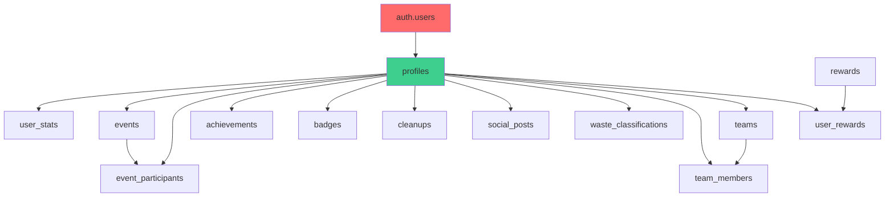
```mermaid
graph TD
    AUTH[auth.users] --> PROF[profiles]
    PROF --> STATS[user_stats]
    PROF --> EVT[events]
    PROF --> EP[event_participants]
    PROF --> ACH[achievements]
    PROF --> BADGE[badges]
    PROF --> CLEAN[cleanups]
    PROF --> SP[social_posts]
    PROF --> WC[waste_classifications]
    PROF --> TM[team_members]
    PROF --> TEAM[teams]
    PROF --> UR[user_rewards]
    
    EVT --> EP
    TEAM --> TM
    REW[rewards] --> UR
    
    style AUTH fill:#ff6b6b
    style PROF fill:#3ecf8e
```

### Foreign Key Reference Table

| Child Table | Column | References | On Delete |
|-------------|--------|-----------|-----------|
| `profiles` | `id` | `auth.users(id)` | CASCADE |
| `user_stats` | `user_id` | `profiles(id)` | CASCADE |
| `events` | `created_by` | `profiles(id)` | CASCADE |
| `event_participants` | `event_id` | `events(id)` | CASCADE |
| `event_participants` | `user_id` | `profiles(id)` | CASCADE |
| `achievements` | `user_id` | `profiles(id)` | CASCADE |
| `badges` | `user_id` | `profiles(id)` | CASCADE |
| `cleanups` | `user_id` | `profiles(id)` | CASCADE |
| `social_posts` | `user_id` | `profiles(id)` | CASCADE |
| `waste_classifications` | `user_id` | `profiles(id)` | CASCADE |
| `team_members` | `team_id` | `teams(id)` | CASCADE |
| `team_members` | `user_id` | `profiles(id)` | CASCADE |
| `teams` | `created_by` | `profiles(id)` | CASCADE |
| `user_rewards` | `user_id` | `profiles(id)` | CASCADE |
| `user_rewards` | `reward_id` | `rewards(id)` | CASCADE |

**Cascade Behavior**: When a user is deleted from `auth.users`, all their related data is automatically deleted via CASCADE constraints.

---

## Database Indexes

While not explicitly defined in the migration, PostgreSQL automatically creates indexes for:

1. **Primary Keys**: All `id` columns have B-tree indexes
2. **Foreign Keys**: All foreign key columns are indexed
3. **Unique Constraints**: `(event_id, user_id)` in event_participants, etc.

### Recommended Additional Indexes (Future Optimization)

```sql
-- Speed up leaderboard queries
CREATE INDEX idx_user_stats_points ON user_stats(points DESC);

-- Speed up event searches by location
CREATE INDEX idx_events_location ON events(location);

-- Speed up event status filtering
CREATE INDEX idx_events_status_date ON events(status, date);

-- Speed up social feed queries
CREATE INDEX idx_social_posts_created_at ON social_posts(created_at DESC);

-- Speed up user activity lookups
CREATE INDEX idx_cleanups_user_date ON cleanups(user_id, date DESC);
```

---

## Database Storage Configuration

### Storage Buckets

| Bucket Name | Public | Purpose |
|------------|--------|---------|
| `avatars` | Yes | User profile pictures |
| `social-photos` | Yes | Event photos, cleanup images |

**Storage RLS Policies:**

```sql
-- Avatar bucket policies
CREATE POLICY "Avatar images are publicly accessible"
ON storage.objects FOR SELECT
USING (bucket_id = 'avatars');

CREATE POLICY "Users can upload their own avatar"
ON storage.objects FOR INSERT
WITH CHECK (
  bucket_id = 'avatars' 
  AND auth.uid()::text = (storage.foldername(name))[1]
);

-- Social photos bucket policies
CREATE POLICY "Social photos are publicly accessible"
ON storage.objects FOR SELECT
USING (bucket_id = 'social-photos');

CREATE POLICY "Authenticated users can upload photos"
ON storage.objects FOR INSERT
WITH CHECK (
  bucket_id = 'social-photos' 
  AND auth.uid() IS NOT NULL
);
```

---

## Component Hierarchy

### Application Component Tree

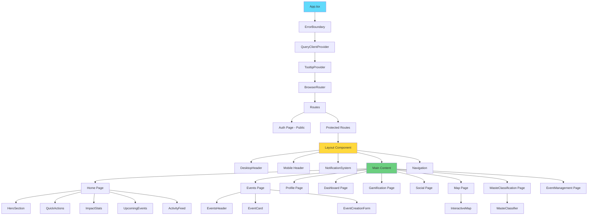
```mermaid
graph TD
    A[App.tsx] --> B[ErrorBoundary]
    B --> C[QueryClientProvider]
    C --> D[TooltipProvider]
    D --> E[BrowserRouter]
    E --> F[Routes]
    
    F --> G[Auth Page - Public]
    F --> H[Protected Routes]
    
    H --> I[Layout Component]
    I --> J[DesktopHeader]
    I --> K[Mobile Header]
    I --> L[NotificationSystem]
    I --> M[Main Content]
    I --> N[Navigation]
    
    M --> O[Home Page]
    M --> P[Events Page]
    M --> Q[Profile Page]
    M --> R[Dashboard Page]
    M --> S[Gamification Page]
    M --> T[Social Page]
    M --> U[Map Page]
    M --> V[WasteClassification Page]
    M --> W[EventManagement Page]
    
    O --> O1[HeroSection]
    O --> O2[QuickActions]
    O --> O3[ImpactStats]
    O --> O4[UpcomingEvents]
    O --> O5[ActivityFeed]
    
    P --> P1[EventsHeader]
    P --> P2[EventCard]
    P --> P3[EventCreationForm]
    
    V --> V1[WasteClassifier]
    
    U --> U1[InteractiveMap]
    
    style A fill:#61dafb
    style I fill:#ffd93d
    style M fill:#6bcf7f
```

### Key Component Relationships

**Layout Component** (`src/components/Layout.tsx`)
- Wrapper for all authenticated pages
- Provides consistent header, navigation, and notification system
- Manages responsive design (mobile vs desktop)

**ProtectedRoute Component** (`src/components/ProtectedRoute.tsx`)
- Guards all authenticated routes
- Redirects to /auth if user not authenticated
- Shows loader during auth check

---

## Routing Structure

### Route Configuration

```mermaid
graph LR
    A[/] --> B[Home Page]
    C[/auth] --> D[Auth Page - Public]
    E[/events] --> F[Events Page]
    G[/events/manage] --> H[Event Management]
    I[/profile] --> J[Profile Page]
    K[/dashboard] --> L[Dashboard Page]
    M[/gamification] --> N[Gamification Page]
    O[/social] --> P[Social Page]
    Q[/waste-classifier] --> R[Waste Classification]
    S[/map] --> T[Map Page]
    U[/admin] --> V[Admin Page]
    
    style D fill:#ff6b6b
    style B fill:#6bcf7f
    style F fill:#6bcf7f
    style H fill:#6bcf7f
    style J fill:#6bcf7f
    style L fill:#6bcf7f
    style N fill:#6bcf7f
    style P fill:#6bcf7f
    style R fill:#6bcf7f
    style T fill:#6bcf7f
    style V fill:#6bcf7f
```

**File: `src/App.tsx`**

All routes except `/auth` are wrapped with `ProtectedRoute` component.

---

## Data Flow Patterns

### React Query Data Flow

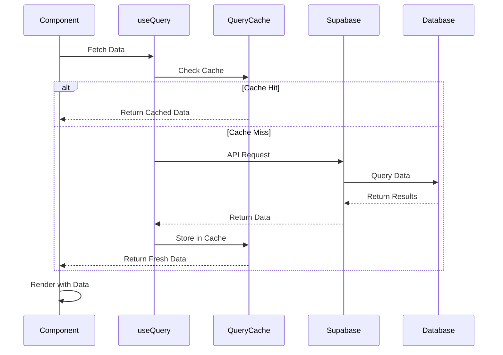
```mermaid
sequenceDiagram
    participant Component
    participant useQuery
    participant QueryCache
    participant Supabase
    participant Database
    
    Component->>useQuery: Fetch Data
    useQuery->>QueryCache: Check Cache
    
    alt Cache Hit
        QueryCache-->>Component: Return Cached Data
    else Cache Miss
        useQuery->>Supabase: API Request
        Supabase->>Database: Query Data
        Database-->>Supabase: Return Results
        Supabase-->>useQuery: Return Data
        useQuery->>QueryCache: Store in Cache
        QueryCache-->>Component: Return Fresh Data
    end
    
    Component->>Component: Render with Data
```

### Mutation Flow (Data Updates)

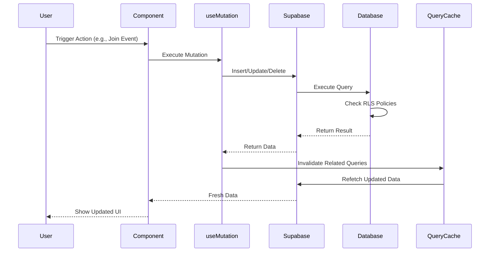
```mermaid
sequenceDiagram
    participant User
    participant Component
    participant useMutation
    participant Supabase
    participant Database
    participant QueryCache
    
    User->>Component: Trigger Action (e.g., Join Event)
    Component->>useMutation: Execute Mutation
    useMutation->>Supabase: Insert/Update/Delete
    Supabase->>Database: Execute Query
    Database->>Database: Check RLS Policies
    Database-->>Supabase: Return Result
    Supabase-->>useMutation: Return Data
    useMutation->>QueryCache: Invalidate Related Queries
    QueryCache->>Supabase: Refetch Updated Data
    Supabase-->>Component: Fresh Data
    Component-->>User: Show Updated UI
```

---

## AI Waste Classification System

### Classification Architecture

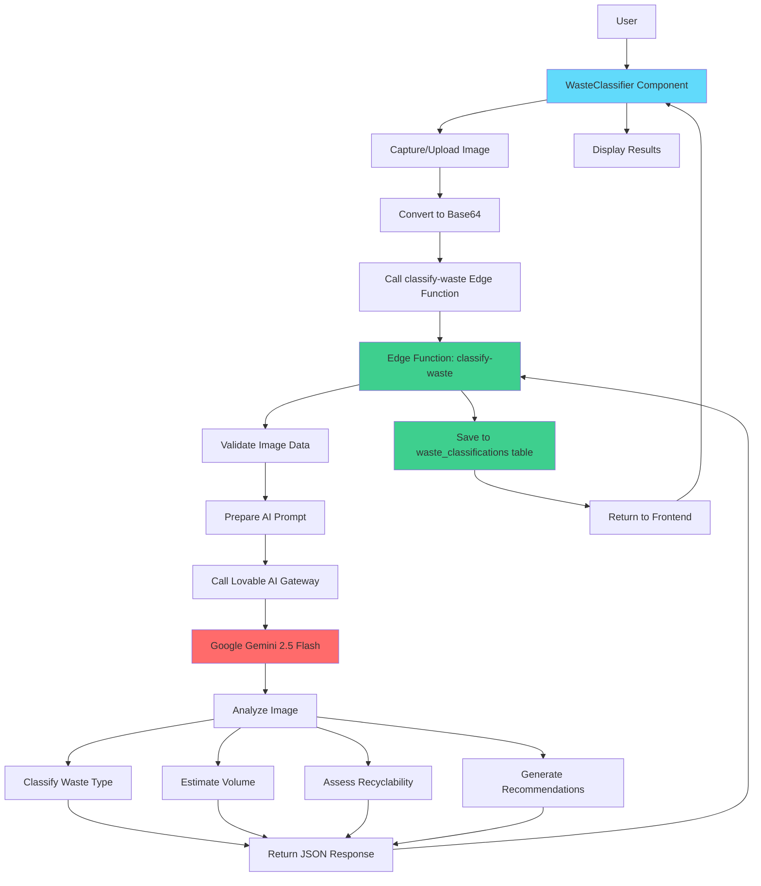
```mermaid
graph TB
    A[User] --> B[WasteClassifier Component]
    B --> C[Capture/Upload Image]
    C --> D[Convert to Base64]
    D --> E[Call classify-waste Edge Function]
    
    E --> F[Edge Function: classify-waste]
    F --> G[Validate Image Data]
    G --> H[Prepare AI Prompt]
    H --> I[Call Lovable AI Gateway]
    
    I --> J[Google Gemini 2.5 Flash]
    J --> K[Analyze Image]
    K --> L[Classify Waste Type]
    K --> M[Estimate Volume]
    K --> N[Assess Recyclability]
    K --> O[Generate Recommendations]
    
    L --> P[Return JSON Response]
    M --> P
    N --> P
    O --> P
    
    P --> F
    F --> Q[Save to waste_classifications table]
    Q --> R[Return to Frontend]
    R --> B
    B --> S[Display Results]
    
    style B fill:#61dafb
    style F fill:#3ecf8e
    style J fill:#ff6b6b
    style Q fill:#3ecf8e
```

### Edge Function Flow

**File: `supabase/functions/classify-waste/index.ts`**

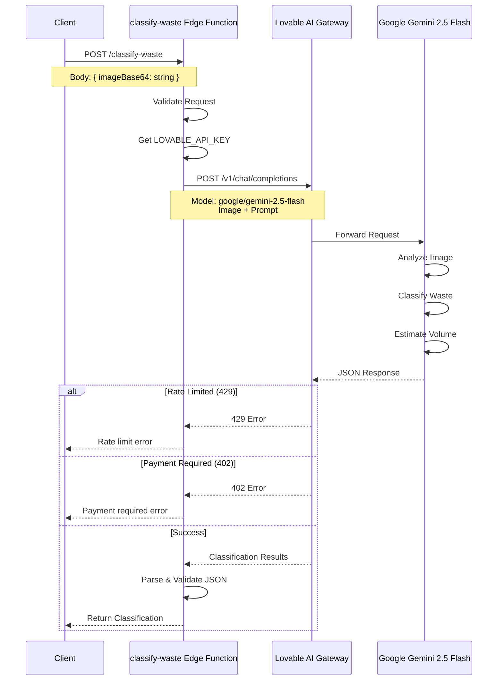
```mermaid
sequenceDiagram
    participant Client
    participant EdgeFn as classify-waste Edge Function
    participant LovableAI as Lovable AI Gateway
    participant Gemini as Google Gemini 2.5 Flash
    
    Client->>EdgeFn: POST /classify-waste
    Note over Client,EdgeFn: Body: { imageBase64: string }
    
    EdgeFn->>EdgeFn: Validate Request
    EdgeFn->>EdgeFn: Get LOVABLE_API_KEY
    
    EdgeFn->>LovableAI: POST /v1/chat/completions
    Note over EdgeFn,LovableAI: Model: google/gemini-2.5-flash<br/>Image + Prompt
    
    LovableAI->>Gemini: Forward Request
    Gemini->>Gemini: Analyze Image
    Gemini->>Gemini: Classify Waste
    Gemini->>Gemini: Estimate Volume
    Gemini-->>LovableAI: JSON Response
    
    alt Rate Limited (429)
        LovableAI-->>EdgeFn: 429 Error
        EdgeFn-->>Client: Rate limit error
    else Payment Required (402)
        LovableAI-->>EdgeFn: 402 Error
        EdgeFn-->>Client: Payment required error
    else Success
        LovableAI-->>EdgeFn: Classification Results
        EdgeFn->>EdgeFn: Parse & Validate JSON
        EdgeFn-->>Client: Return Classification
    end
```

### Classification Categories

The AI classifies waste into these categories:

| Category | Sub-categories | Recyclable |
|----------|---------------|------------|
| **Plastic** | Bottles, bags, containers, wrappers, straws | Yes/No (depends) |
| **Paper** | Cardboard, newspaper, magazines, office paper | Yes |
| **Metal** | Aluminum cans, steel cans, foil, scrap metal | Yes |
| **Glass** | Bottles, jars, broken glass | Yes |
| **Organic** | Food waste, yard waste, biodegradable | Compostable |
| **Electronic** | E-waste, batteries, circuits | Special handling |
| **Hazardous** | Chemicals, medical waste, paint | Special disposal |

---

## Event Management System

### Event Creation Flow

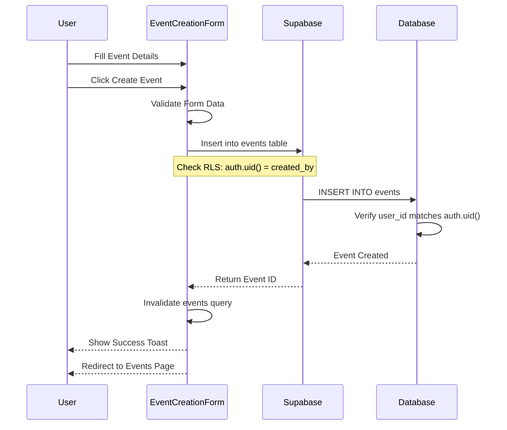
```mermaid
sequenceDiagram
    participant User
    participant EventForm as EventCreationForm
    participant Supabase
    participant Database
    
    User->>EventForm: Fill Event Details
    User->>EventForm: Click Create Event
    
    EventForm->>EventForm: Validate Form Data
    
    EventForm->>Supabase: Insert into events table
    Note over EventForm,Supabase: Check RLS: auth.uid() = created_by
    
    Supabase->>Database: INSERT INTO events
    Database->>Database: Verify user_id matches auth.uid()
    Database-->>Supabase: Event Created
    
    Supabase-->>EventForm: Return Event ID
    EventForm->>EventForm: Invalidate events query
    EventForm-->>User: Show Success Toast
    EventForm-->>User: Redirect to Events Page
```

### Event Participation Flow

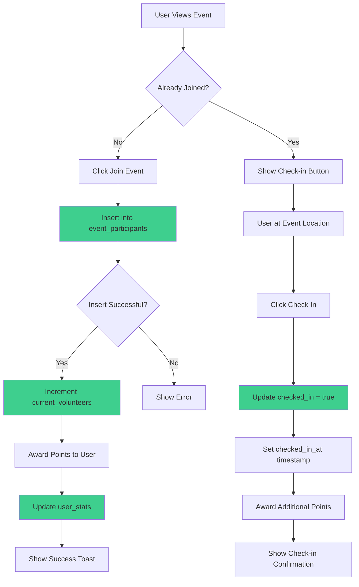
```mermaid
graph TD
    A[User Views Event] --> B{Already Joined?}
    B -->|No| C[Click Join Event]
    B -->|Yes| D[Show Check-in Button]
    
    C --> E[Insert into event_participants]
    E --> F{Insert Successful?}
    F -->|Yes| G[Increment current_volunteers]
    F -->|No| H[Show Error]
    
    G --> I[Award Points to User]
    I --> J[Update user_stats]
    J --> K[Show Success Toast]
    
    D --> L[User at Event Location]
    L --> M[Click Check In]
    M --> N[Update checked_in = true]
    N --> O[Set checked_in_at timestamp]
    O --> P[Award Additional Points]
    P --> Q[Show Check-in Confirmation]
    
    style E fill:#3ecf8e
    style G fill:#3ecf8e
    style J fill:#3ecf8e
    style N fill:#3ecf8e
```

### Event Status Management

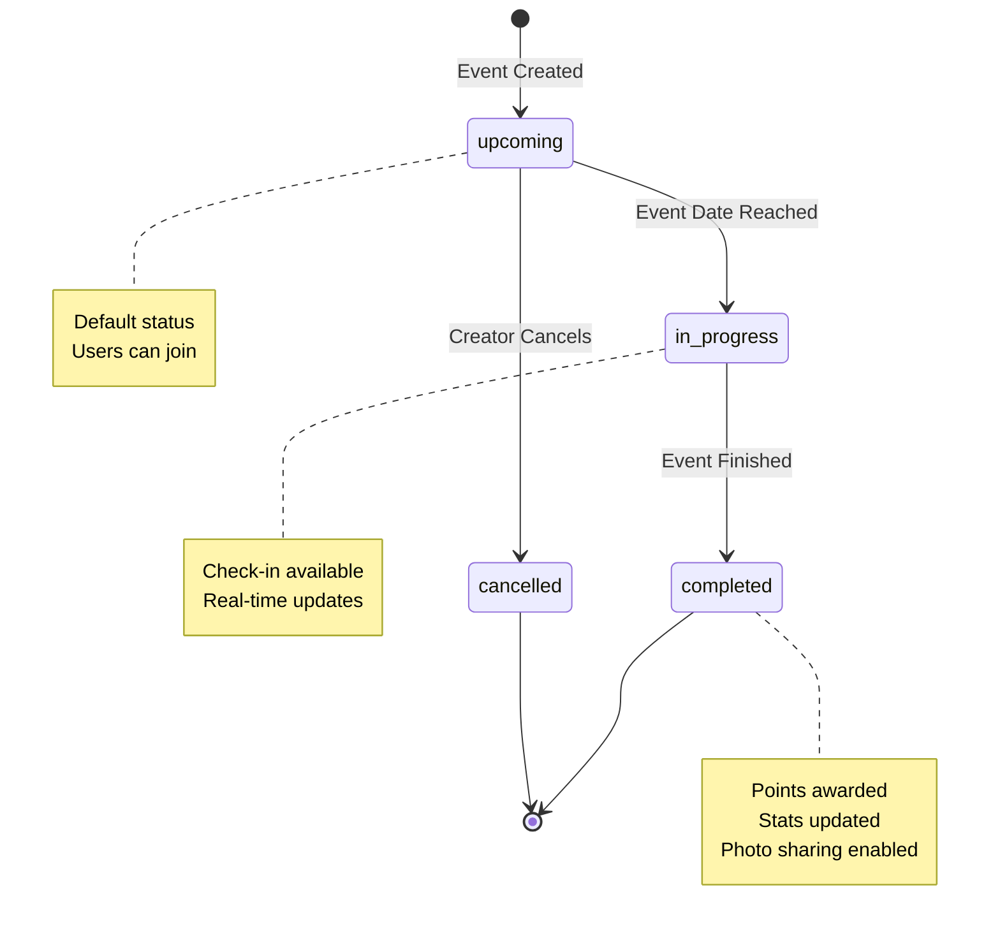
```mermaid
stateDiagram-v2
    [*] --> upcoming: Event Created
    upcoming --> in_progress: Event Date Reached
    upcoming --> cancelled: Creator Cancels
    in_progress --> completed: Event Finished
    completed --> [*]
    cancelled --> [*]
    
    note right of upcoming
        Default status
        Users can join
    end note
    
    note right of in_progress
        Check-in available
        Real-time updates
    end note
    
    note right of completed
        Points awarded
        Stats updated
        Photo sharing enabled
    end note
```

---

## Gamification System

### Points & Leveling System

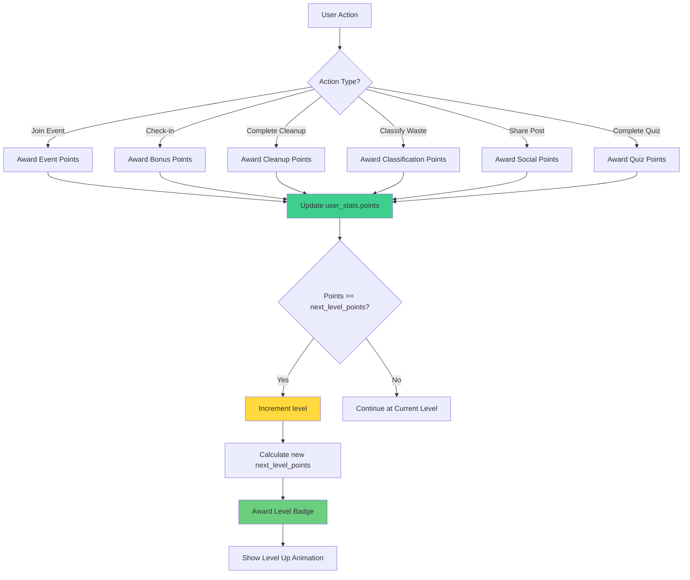
```mermaid
graph TD
    A[User Action] --> B{Action Type?}
    
    B -->|Join Event| C[Award Event Points]
    B -->|Check-in| D[Award Bonus Points]
    B -->|Complete Cleanup| E[Award Cleanup Points]
    B -->|Classify Waste| F[Award Classification Points]
    B -->|Share Post| G[Award Social Points]
    B -->|Complete Quiz| H[Award Quiz Points]
    
    C --> I[Update user_stats.points]
    D --> I
    E --> I
    F --> I
    G --> I
    H --> I
    
    I --> J{Points >= next_level_points?}
    J -->|Yes| K[Increment level]
    K --> L[Calculate new next_level_points]
    L --> M[Award Level Badge]
    M --> N[Show Level Up Animation]
    
    J -->|No| O[Continue at Current Level]
    
    style I fill:#3ecf8e
    style K fill:#ffd93d
    style M fill:#6bcf7f
```

### Achievement System

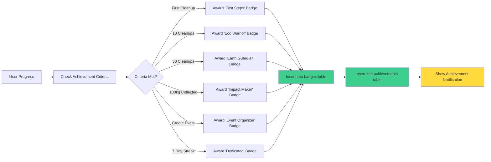
```mermaid
graph LR
    A[User Progress] --> B[Check Achievement Criteria]
    B --> C{Criteria Met?}
    
    C -->|First Cleanup| D[Award 'First Steps' Badge]
    C -->|10 Cleanups| E[Award 'Eco Warrior' Badge]
    C -->|50 Cleanups| F[Award 'Earth Guardian' Badge]
    C -->|100kg Collected| G[Award 'Impact Maker' Badge]
    C -->|Create Event| H[Award 'Event Organizer' Badge]
    C -->|7 Day Streak| I[Award 'Dedicated' Badge]
    
    D --> J[Insert into badges table]
    E --> J
    F --> J
    G --> J
    H --> J
    I --> J
    
    J --> K[Insert into achievements table]
    K --> L[Show Achievement Notification]
    
    style J fill:#3ecf8e
    style K fill:#3ecf8e
    style L fill:#ffd93d
```

### Leaderboard Calculation

```mermaid
graph TD
    A[Leaderboard Component Mounts] --> B[Query user_stats table]
    B --> C[Order by points DESC]
    C --> D[Limit to Top 10]
    D --> E[Join with profiles table]
    E --> F[Get user names & avatars]
    F --> G[Calculate Rankings]
    G --> H{Current User in Top 10?}
    H -->|Yes| I[Highlight User Row]
    H -->|No| J[Show User's Rank Below]
    I --> K[Display Leaderboard]
    J --> K
    
    style B fill:#3ecf8e
    style E fill:#3ecf8e
```

---

## Real-time Features

### Real-time Event Updates

```mermaid
sequenceDiagram
    participant UserA as User A Browser
    participant UserB as User B Browser
    participant Supabase
    participant RealtimeService as Realtime Service
    participant Database
    
    UserA->>Supabase: Subscribe to events channel
    UserB->>Supabase: Subscribe to events channel
    Supabase->>RealtimeService: Register subscriptions
    
    UserA->>Database: Join Event (INSERT)
    Database->>RealtimeService: Broadcast INSERT event
    RealtimeService->>UserA: Notify: New participant
    RealtimeService->>UserB: Notify: New participant
    
    UserB->>UserB: Update UI with new count
    UserA->>UserA: Update UI with new count
    
    UserA->>Database: Check-in (UPDATE)
    Database->>RealtimeService: Broadcast UPDATE event
    RealtimeService->>UserA: Notify: Check-in recorded
    RealtimeService->>UserB: Notify: Someone checked in
    
    UserB->>UserB: Refresh event status
```

### Notification System Flow

```mermaid
graph TD
    A[User Action Occurs] --> B{Action Type?}
    
    B -->|New Event| C[Create Event Notification]
    B -->|Event Update| D[Create Update Notification]
    B -->|Achievement Earned| E[Create Achievement Notification]
    B -->|Level Up| F[Create Level Up Notification]
    B -->|Event Reminder| G[Create Reminder Notification]
    
    C --> H[Store in notifications state]
    D --> H
    E --> H
    F --> H
    G --> H
    
    H --> I[Display Toast Notification]
    I --> J[Show in Notification Bell]
    J --> K{User Clicks?}
    K -->|Yes| L[Navigate to Relevant Page]
    K -->|Dismiss| M[Mark as Read]
    
    style I fill:#ffd93d
```

---

## Security Implementation

### Authentication Security Flow

```mermaid
graph TD
    A[User Request] --> B{Has Valid Session Token?}
    B -->|No| C[Redirect to /auth]
    B -->|Yes| D[Extract user_id from JWT]
    
    D --> E[Database Query]
    E --> F[Apply RLS Policies]
    F --> G{Policy: auth.uid = user_id?}
    
    G -->|Yes| H[Allow Access]
    G -->|No| I[Deny Access - 403]
    
    H --> J[Return Data]
    I --> K[Return Error]
    
    style D fill:#3ecf8e
    style F fill:#ff6b6b
    style G fill:#ffd93d
```

### Edge Function Security

```mermaid
graph TD
    A[Edge Function Request] --> B[Handle CORS Preflight]
    B --> C{Method = OPTIONS?}
    C -->|Yes| D[Return CORS Headers]
    C -->|No| E[Process Request]
    
    E --> F[Validate Input Data]
    F --> G{Valid Input?}
    G -->|No| H[Return 400 Bad Request]
    G -->|Yes| I[Check Rate Limits]
    
    I --> J{Within Limits?}
    J -->|No| K[Return 429 Too Many Requests]
    J -->|Yes| L[Execute Function Logic]
    
    L --> M{Has Required Secrets?}
    M -->|No| N[Return 500 Internal Error]
    M -->|Yes| O[Process Successfully]
    
    O --> P[Return Response with CORS]
    
    style F fill:#ffd93d
    style I fill:#ff6b6b
    style M fill:#ff6b6b
```

### Row Level Security (RLS) Enforcement

```mermaid
graph LR
    A[Client Request] --> B[Supabase Client]
    B --> C[Include JWT Token]
    C --> D[PostgreSQL Database]
    D --> E[Extract auth.uid from JWT]
    E --> F[Apply RLS Policy]
    
    F --> G{SELECT Policy}
    F --> H{INSERT Policy}
    F --> I{UPDATE Policy}
    F --> J{DELETE Policy}
    
    G --> K{auth.uid = user_id?}
    H --> K
    I --> K
    J --> K
    
    K -->|Yes| L[Execute Query]
    K -->|No| M[Block Query]
    
    L --> N[Return Results]
    M --> O[Return Empty/Error]
    
    style E fill:#3ecf8e
    style F fill:#ff6b6b
    style K fill:#ffd93d
```

---

## Interactive Map System

### Map Component Architecture

```mermaid
graph TD
    A[InteractiveMap Component] --> B[Load India Map Image]
    B --> C[Fetch Events from Database]
    C --> D[Filter by Status = upcoming]
    
    D --> E[Map Events to City Positions]
    E --> F{Event Location Matched?}
    F -->|Yes| G[Calculate Pixel Position]
    F -->|No| H[Skip Event]
    
    G --> I[Render Event Pin]
    I --> J[Show Event Count Badge]
    J --> K[Add Click Handler]
    
    K --> L[User Clicks Pin]
    L --> M[Show Event Details Popup]
    M --> N[Display Event Info]
    N --> O[Show Join Button]
    
    O --> P[User Joins Event]
    P --> Q[Update Database]
    Q --> R[Refresh Map]
    
    style C fill:#3ecf8e
    style Q fill:#3ecf8e
```

**File: `src/components/InteractiveMap.tsx`**

City positions are mapped using percentage-based coordinates:

```javascript
const CITY_POSITIONS = {
  "Mumbai": { x: 26, y: 54 },
  "Goa": { x: 24, y: 62 },
  "Chennai": { x: 52, y: 70 },
  // ... more cities
}
```

### Mapbox Token Edge Function

**File: `supabase/functions/mapbox-token/index.ts`**

```mermaid
sequenceDiagram
    participant Client
    participant EdgeFn as mapbox-token Function
    participant Secrets
    
    Client->>EdgeFn: GET /mapbox-token
    EdgeFn->>Secrets: Retrieve MAPBOX_ACCESS_TOKEN
    Secrets-->>EdgeFn: Return Token
    EdgeFn-->>Client: { token: "pk.ey..." }
```

This edge function securely provides the Mapbox token without exposing it in client-side code.

---

## User Journey Flows

### Complete User Onboarding Journey

```mermaid
journey
    title New User Onboarding Journey
    section Authentication
      Visit Website: 3: User
      Click Sign Up: 4: User
      Enter Details: 4: User
      Verify Email: 5: User
      Auto-login: 5: System
    section First Experience
      View Home Page: 5: User
      See Impact Stats: 4: User
      Browse Events: 4: User
      View Quick Actions: 3: User
    section First Action
      Click AI Classifier: 4: User
      Upload Waste Image: 5: User
      View Classification: 5: User, System
      Learn Disposal Method: 5: User
    section Engagement
      Join First Event: 5: User
      Earn First Points: 5: User, System
      Receive Achievement: 5: User, System
      Check Leaderboard: 4: User
    section Community
      View Social Feed: 4: User
      Share Progress: 5: User
      Get Reactions: 5: User, Community
```

### Event Participation Journey

```mermaid
journey
    title Event Participation Journey
    section Discovery
      Browse Events: 4: User
      Filter by Location: 4: User
      View Event Details: 5: User
      Check Difficulty: 4: User
    section Registration
      Click Join Event: 5: User
      Confirm Participation: 5: User
      Receive Confirmation: 5: System
      Add to Calendar: 4: User
    section Event Day
      Arrive at Location: 5: User
      Check-in via App: 5: User
      Participate in Cleanup: 5: User
      Collect Waste Data: 4: User
    section Post-Event
      Upload Photos: 5: User
      Share Experience: 5: User
      Receive Points: 5: System
      View Impact Stats: 5: User
      Earn Badges: 5: System
```

---

## Performance Optimization

### Code Splitting Strategy

```mermaid
graph TD
    A[App Bundle] --> B[Core Bundle]
    A --> C[Route-based Chunks]
    
    B --> B1[React Core]
    B --> B2[Router]
    B --> B3[Auth Logic]
    B --> B4[Common Components]
    
    C --> C1[Home Page Chunk]
    C --> C2[Events Page Chunk]
    C --> C3[Profile Page Chunk]
    C --> C4[Map Page Chunk]
    C --> C5[AI Classifier Chunk]
    
    C5 --> C5A[Mapbox GL JS]
    C5 --> C5B[Large Dependencies]
    
    style B fill:#61dafb
    style C5 fill:#ff6b6b
```

### React Query Caching Strategy

| Query Key | Stale Time | Cache Time | Refetch On |
|-----------|-----------|-----------|------------|
| `events` | 30s | 5min | Window focus, Mount |
| `user-stats` | 1min | 10min | Mount |
| `profile` | 5min | 30min | Mount |
| `leaderboard` | 30s | 5min | Window focus |
| `social-posts` | 10s | 2min | Window focus |

---

## Error Handling Architecture

### Error Boundary Implementation

```mermaid
graph TD
    A[Component Tree] --> B{Error Occurs?}
    B -->|Yes| C[ErrorBoundary Catches]
    B -->|No| D[Normal Rendering]
    
    C --> E{Error Type?}
    E -->|Network Error| F[Show Retry Button]
    E -->|Auth Error| G[Redirect to Login]
    E -->|Generic Error| H[Show Error UI]
    
    F --> I[Log Error to Console]
    G --> I
    H --> I
    
    I --> J[Display User-Friendly Message]
    
    style C fill:#ff6b6b
    style I fill:#ffd93d
```

**File: `src/components/ErrorBoundary.tsx`**

Catches React rendering errors and displays fallback UI.

---

## Deployment & Build Process

### Build Pipeline

```mermaid
graph LR
    A[Developer Push] --> B[Vite Build]
    B --> C[TypeScript Compilation]
    C --> D[Tailwind CSS Processing]
    D --> E[Asset Optimization]
    E --> F[Bundle Generation]
    F --> G[Deploy to Lovable]
    
    G --> H[Edge Functions Deploy]
    G --> I[Static Assets Upload]
    G --> J[Database Migrations]
    
    J --> K[Run SQL Scripts]
    K --> L[Update RLS Policies]
    L --> M[Verify Deployment]
    
    style G fill:#6bcf7f
    style J fill:#3ecf8e
    style M fill:#ffd93d
```

---

## Key Files Reference

### Critical Files & Their Purposes

| File Path | Purpose | Dependencies |
|-----------|---------|--------------|
| `src/App.tsx` | Root component, routing setup | React Router, Auth |
| `src/hooks/useAuth.ts` | Authentication state management | Supabase Auth |
| `src/components/ProtectedRoute.tsx` | Route protection | useAuth hook |
| `src/components/Layout.tsx` | Page layout wrapper | Navigation, Header |
| `src/integrations/supabase/client.ts` | Supabase client instance | AUTO-GENERATED |
| `supabase/functions/classify-waste/index.ts` | AI waste classification | Lovable AI Gateway |
| `supabase/functions/mapbox-token/index.ts` | Secure token provider | Mapbox API |

---

## Environment Variables

### Required Environment Variables

```bash
# Supabase Configuration (Auto-configured by Lovable Cloud)
VITE_SUPABASE_URL=https://njgnpkqkedwfdzylngdt.supabase.co
VITE_SUPABASE_PUBLISHABLE_KEY=eyJhbGciOiJIUzI1NiIsInR5cCI6IkpXVCJ9...
VITE_SUPABASE_PROJECT_ID=njgnpkqkedwfdzylngdt

# Edge Function Secrets (Server-side only)
LOVABLE_API_KEY=************ (auto-provided)
MAPBOX_ACCESS_TOKEN=************ (manually configured)
SUPABASE_SERVICE_ROLE_KEY=************ (auto-provided)
SUPABASE_DB_URL=************ (auto-provided)
```

---

## Summary

This documentation covers the complete architecture of Eco-Sanjivani, including:

✅ **System Architecture** - High-level overview and technology stack  
✅ **Authentication Flow** - User login, signup, and protected routes  
✅ **Database Design** - ER diagrams, RLS policies, and relationships  
✅ **Component Structure** - React component hierarchy  
✅ **Routing System** - All routes and navigation  
✅ **Data Management** - React Query patterns and mutations  
✅ **AI Classification** - Waste classification system architecture  
✅ **Event System** - Event creation, participation, and management  
✅ **Gamification** - Points, levels, badges, and achievements  
✅ **Real-time Features** - Live updates and notifications  
✅ **Security** - Authentication, RLS, and edge function security  
✅ **Map System** - Interactive map implementation  
✅ **User Journeys** - Complete user experience flows  

For any questions or clarifications about specific components or flows, refer to the relevant section above or check the source code files referenced throughout this documentation.