# Eco-Sanjivani Technical Documentation

## Table of Contents

1. [System Architecture Overview](#system-architecture-overview)
2. [Authentication Flow](#authentication-flow)
3. [Database Architecture](#database-architecture)
4. [Component Hierarchy](#component-hierarchy)
5. [Routing Structure](#routing-structure)
6. [Data Flow Patterns](#data-flow-patterns)
7. [AI Waste Classification System](#ai-waste-classification-system)
8. [Event Management System](#event-management-system)
9. [Gamification System](#gamification-system)
10. [Real-time Features](#real-time-features)
11. [Security Implementation](#security-implementation)

---

## System Architecture Overview

### High-Level Architecture

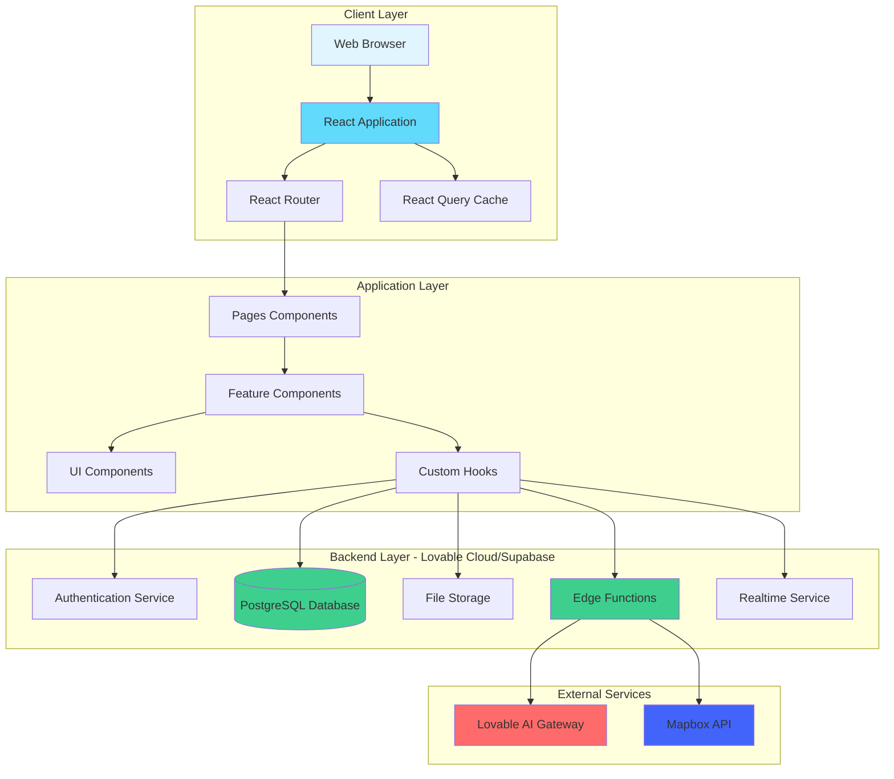
```mermaid
graph TB
    subgraph "Client Layer"
        Browser[Web Browser]
        React[React Application]
        Router[React Router]
        Query[React Query Cache]
    end
    
    subgraph "Application Layer"
        Pages[Pages Components]
        Features[Feature Components]
        UI[UI Components]
        Hooks[Custom Hooks]
    end
    
    subgraph "Backend Layer - Lovable Cloud/Supabase"
        Auth[Authentication Service]
        DB[(PostgreSQL Database)]
        Storage[File Storage]
        EdgeFn[Edge Functions]
        Realtime[Realtime Service]
    end
    
    subgraph "External Services"
        LovableAI[Lovable AI Gateway]
        Mapbox[Mapbox API]
    end
    
    Browser --> React
    React --> Router
    React --> Query
    Router --> Pages
    Pages --> Features
    Features --> UI
    Features --> Hooks
    
    Hooks --> Auth
    Hooks --> DB
    Hooks --> Storage
    Hooks --> EdgeFn
    Hooks --> Realtime
    
    EdgeFn --> LovableAI
    EdgeFn --> Mapbox
    
    style Browser fill:#e1f5ff
    style React fill:#61dafb
    style DB fill:#3ecf8e
    style EdgeFn fill:#3ecf8e
    style LovableAI fill:#ff6b6b
    style Mapbox fill:#4264fb
```

### Technology Stack

| Layer | Technologies |
|-------|-------------|
| **Frontend** | React 18, TypeScript, Vite |
| **Routing** | React Router v6 |
| **State Management** | React Query (TanStack Query) |
| **UI Framework** | Tailwind CSS, Radix UI, shadcn/ui |
| **Backend** | Lovable Cloud (Supabase) |
| **Database** | PostgreSQL with Row Level Security |
| **Authentication** | Supabase Auth |
| **Storage** | Supabase Storage |
| **Serverless** | Deno Edge Functions |
| **AI** | Lovable AI Gateway (Google Gemini 2.5 Flash) |
| **Maps** | Mapbox GL JS |

---

## Authentication Flow

### User Authentication Journey

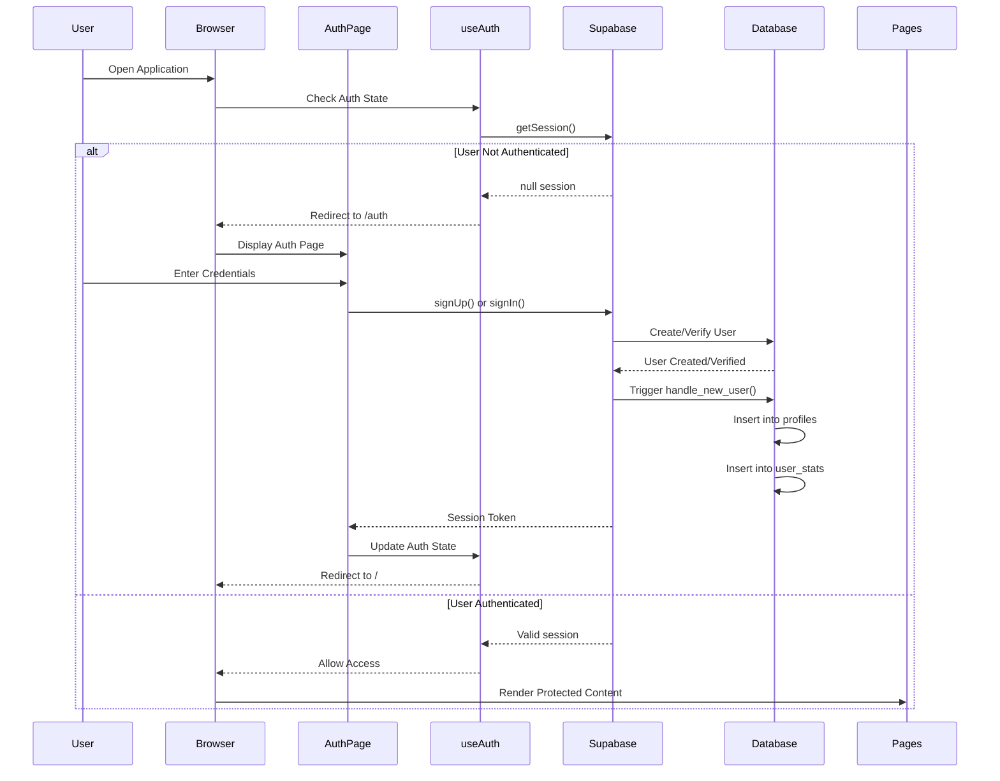
```mermaid
sequenceDiagram
    participant User
    participant Browser
    participant AuthPage
    participant useAuth
    participant Supabase
    participant Database
    
    User->>Browser: Open Application
    Browser->>useAuth: Check Auth State
    useAuth->>Supabase: getSession()
    
    alt User Not Authenticated
        Supabase-->>useAuth: null session
        useAuth-->>Browser: Redirect to /auth
        Browser->>AuthPage: Display Auth Page
        User->>AuthPage: Enter Credentials
        AuthPage->>Supabase: signUp() or signIn()
        Supabase->>Database: Create/Verify User
        Database-->>Supabase: User Created/Verified
        Supabase->>Database: Trigger handle_new_user()
        Database->>Database: Insert into profiles
        Database->>Database: Insert into user_stats
        Supabase-->>AuthPage: Session Token
        AuthPage->>useAuth: Update Auth State
        useAuth-->>Browser: Redirect to /
    else User Authenticated
        Supabase-->>useAuth: Valid session
        useAuth-->>Browser: Allow Access
        Browser->>Pages: Render Protected Content
    end
```

### Authentication Hook Flow

**File: `src/hooks/useAuth.ts`**

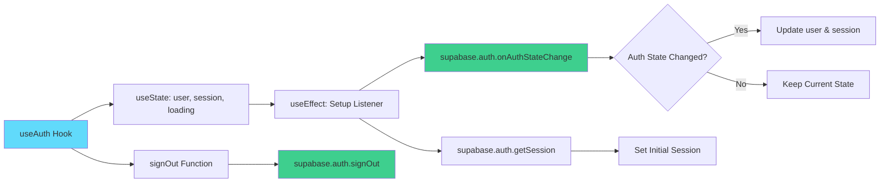
```mermaid
graph LR
    A[useAuth Hook] --> B[useState: user, session, loading]
    B --> C[useEffect: Setup Listener]
    C --> D[supabase.auth.onAuthStateChange]
    D --> E{Auth State Changed?}
    E -->|Yes| F[Update user & session]
    E -->|No| G[Keep Current State]
    C --> H[supabase.auth.getSession]
    H --> I[Set Initial Session]
    A --> J[signOut Function]
    J --> K[supabase.auth.signOut]
    
    style A fill:#61dafb
    style D fill:#3ecf8e
    style K fill:#3ecf8e
```

### Protected Route Implementation

**File: `src/components/ProtectedRoute.tsx`**

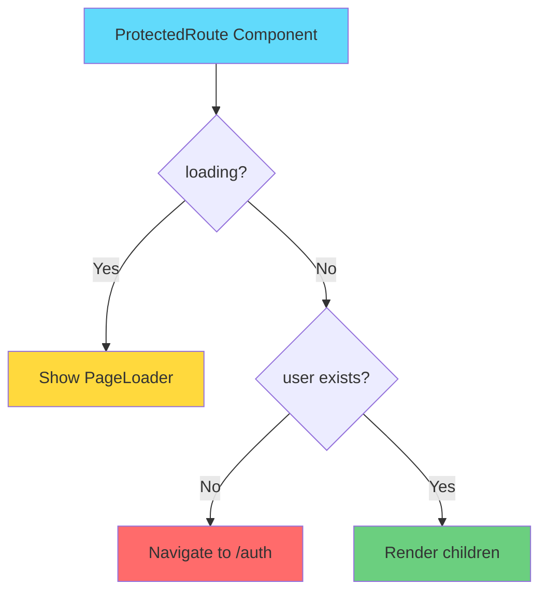
```mermaid
graph TD
    A[ProtectedRoute Component] --> B{loading?}
    B -->|Yes| C[Show PageLoader]
    B -->|No| D{user exists?}
    D -->|No| E[Navigate to /auth]
    D -->|Yes| F[Render children]
    
    style A fill:#61dafb
    style C fill:#ffd93d
    style E fill:#ff6b6b
    style F fill:#6bcf7f
```

---

## Database Architecture

### Entity Relationship Diagram

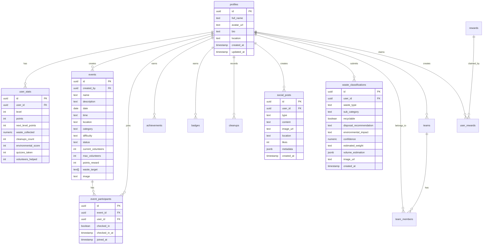
```mermaid
erDiagram
    profiles ||--o{ user_stats : has
    profiles ||--o{ events : creates
    profiles ||--o{ event_participants : joins
    profiles ||--o{ achievements : earns
    profiles ||--o{ badges : earns
    profiles ||--o{ cleanups : records
    profiles ||--o{ social_posts : creates
    profiles ||--o{ waste_classifications : submits
    profiles ||--o{ team_members : belongs_to
    profiles ||--o{ teams : creates
    profiles ||--o{ user_rewards : claims
    
    events ||--o{ event_participants : has
    teams ||--o{ team_members : has
    rewards ||--o{ user_rewards : claimed_by
    
    profiles {
        uuid id PK
        text full_name
        text avatar_url
        text bio
        text location
        timestamp created_at
        timestamp updated_at
    }
    
    user_stats {
        uuid id PK
        uuid user_id FK
        int level
        int points
        int next_level_points
        numeric waste_collected
        int cleanups_count
        int environmental_score
        int quizzes_taken
        int volunteers_helped
    }
    
    events {
        uuid id PK
        uuid created_by FK
        text name
        text description
        date date
        text time
        text location
        text category
        text difficulty
        text status
        int current_volunteers
        int max_volunteers
        int points_reward
        text[] waste_target
        text image
    }
    
    event_participants {
        uuid id PK
        uuid event_id FK
        uuid user_id FK
        boolean checked_in
        timestamp checked_in_at
        timestamp joined_at
    }
    
    social_posts {
        uuid id PK
        uuid user_id FK
        text type
        text content
        text image_url
        text location
        int likes
        jsonb metadata
        timestamp created_at
    }
    
    waste_classifications {
        uuid id PK
        uuid user_id FK
        text waste_type
        text sub_category
        boolean recyclable
        text disposal_recommendation
        text environmental_impact
        numeric confidence
        text estimated_weight
        jsonb volume_estimation
        text image_url
        timestamp created_at
    }
```

### Database Triggers & Functions

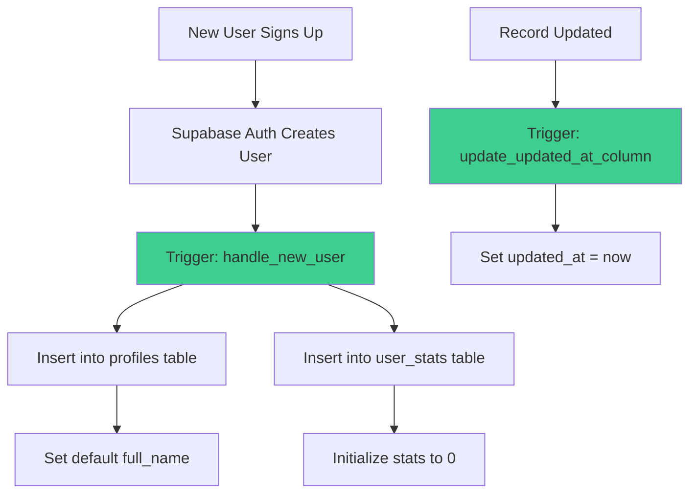
```mermaid
graph TD
    A[New User Signs Up] --> B[Supabase Auth Creates User]
    B --> C[Trigger: handle_new_user]
    C --> D[Insert into profiles table]
    C --> E[Insert into user_stats table]
    D --> F[Set default full_name]
    E --> G[Initialize stats to 0]
    
    H[Record Updated] --> I[Trigger: update_updated_at_column]
    I --> J[Set updated_at = now]
    
    style C fill:#3ecf8e
    style I fill:#3ecf8e
```

### Row Level Security (RLS) Policies

| Table | SELECT | INSERT | UPDATE | DELETE |
|-------|--------|--------|--------|--------|
| **profiles** | Everyone | Own profile | Own profile | ❌ |
| **user_stats** | Everyone | Own stats | Own stats | ❌ |
| **events** | Authenticated | Own events | Own events | Own events |
| **event_participants** | Authenticated | Own participation | Own participation | Own participation |
| **achievements** | Everyone | Own achievements | Own achievements | ❌ |
| **social_posts** | Authenticated | Own posts | Own posts | Own posts |
| **waste_classifications** | Own classifications | Own classifications | ❌ | Own classifications |

---

## Component Hierarchy

### Application Component Tree

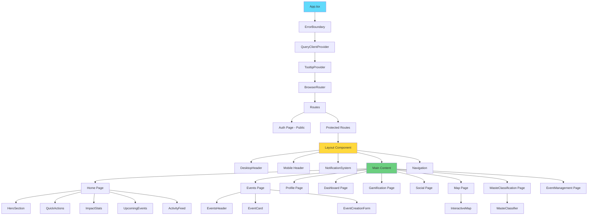
```mermaid
graph TD
    A[App.tsx] --> B[ErrorBoundary]
    B --> C[QueryClientProvider]
    C --> D[TooltipProvider]
    D --> E[BrowserRouter]
    E --> F[Routes]
    
    F --> G[Auth Page - Public]
    F --> H[Protected Routes]
    
    H --> I[Layout Component]
    I --> J[DesktopHeader]
    I --> K[Mobile Header]
    I --> L[NotificationSystem]
    I --> M[Main Content]
    I --> N[Navigation]
    
    M --> O[Home Page]
    M --> P[Events Page]
    M --> Q[Profile Page]
    M --> R[Dashboard Page]
    M --> S[Gamification Page]
    M --> T[Social Page]
    M --> U[Map Page]
    M --> V[WasteClassification Page]
    M --> W[EventManagement Page]
    
    O --> O1[HeroSection]
    O --> O2[QuickActions]
    O --> O3[ImpactStats]
    O --> O4[UpcomingEvents]
    O --> O5[ActivityFeed]
    
    P --> P1[EventsHeader]
    P --> P2[EventCard]
    P --> P3[EventCreationForm]
    
    V --> V1[WasteClassifier]
    
    U --> U1[InteractiveMap]
    
    style A fill:#61dafb
    style I fill:#ffd93d
    style M fill:#6bcf7f
```

### Key Component Relationships

**Layout Component** (`src/components/Layout.tsx`)
- Wrapper for all authenticated pages
- Provides consistent header, navigation, and notification system
- Manages responsive design (mobile vs desktop)

**ProtectedRoute Component** (`src/components/ProtectedRoute.tsx`)
- Guards all authenticated routes
- Redirects to /auth if user not authenticated
- Shows loader during auth check

---

## Routing Structure

### Route Configuration

```mermaid
graph LR
    A[/] --> B[Home Page]
    C[/auth] --> D[Auth Page - Public]
    E[/events] --> F[Events Page]
    G[/events/manage] --> H[Event Management]
    I[/profile] --> J[Profile Page]
    K[/dashboard] --> L[Dashboard Page]
    M[/gamification] --> N[Gamification Page]
    O[/social] --> P[Social Page]
    Q[/waste-classifier] --> R[Waste Classification]
    S[/map] --> T[Map Page]
    U[/admin] --> V[Admin Page]
    
    style D fill:#ff6b6b
    style B fill:#6bcf7f
    style F fill:#6bcf7f
    style H fill:#6bcf7f
    style J fill:#6bcf7f
    style L fill:#6bcf7f
    style N fill:#6bcf7f
    style P fill:#6bcf7f
    style R fill:#6bcf7f
    style T fill:#6bcf7f
    style V fill:#6bcf7f
```

**File: `src/App.tsx`**

All routes except `/auth` are wrapped with `ProtectedRoute` component.

---

## Data Flow Patterns

### React Query Data Flow

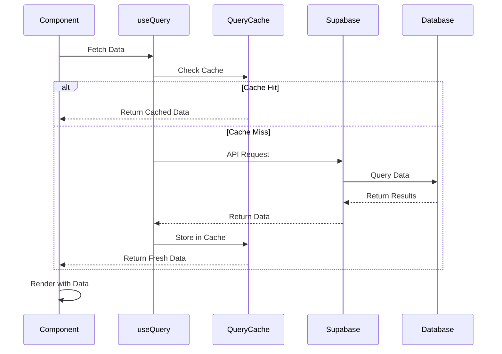
```mermaid
sequenceDiagram
    participant Component
    participant useQuery
    participant QueryCache
    participant Supabase
    participant Database
    
    Component->>useQuery: Fetch Data
    useQuery->>QueryCache: Check Cache
    
    alt Cache Hit
        QueryCache-->>Component: Return Cached Data
    else Cache Miss
        useQuery->>Supabase: API Request
        Supabase->>Database: Query Data
        Database-->>Supabase: Return Results
        Supabase-->>useQuery: Return Data
        useQuery->>QueryCache: Store in Cache
        QueryCache-->>Component: Return Fresh Data
    end
    
    Component->>Component: Render with Data
```

### Mutation Flow (Data Updates)

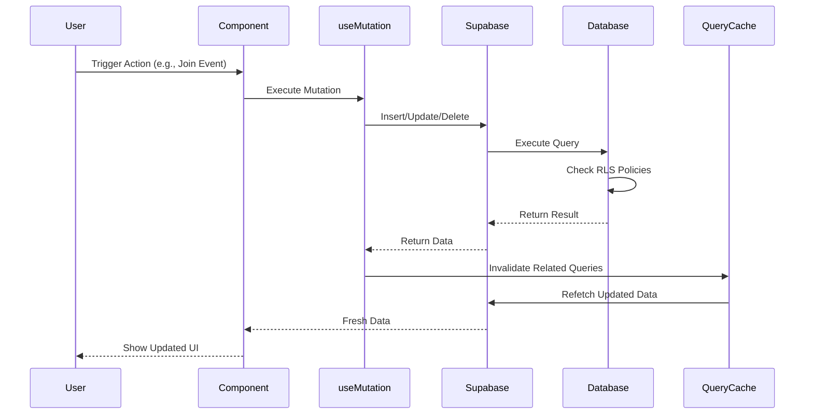
```mermaid
sequenceDiagram
    participant User
    participant Component
    participant useMutation
    participant Supabase
    participant Database
    participant QueryCache
    
    User->>Component: Trigger Action (e.g., Join Event)
    Component->>useMutation: Execute Mutation
    useMutation->>Supabase: Insert/Update/Delete
    Supabase->>Database: Execute Query
    Database->>Database: Check RLS Policies
    Database-->>Supabase: Return Result
    Supabase-->>useMutation: Return Data
    useMutation->>QueryCache: Invalidate Related Queries
    QueryCache->>Supabase: Refetch Updated Data
    Supabase-->>Component: Fresh Data
    Component-->>User: Show Updated UI
```

---

## AI Waste Classification System

### Classification Architecture

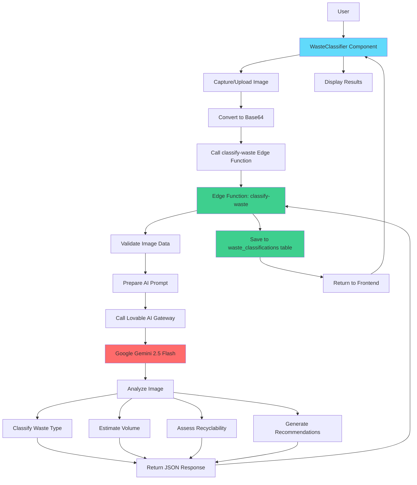
```mermaid
graph TB
    A[User] --> B[WasteClassifier Component]
    B --> C[Capture/Upload Image]
    C --> D[Convert to Base64]
    D --> E[Call classify-waste Edge Function]
    
    E --> F[Edge Function: classify-waste]
    F --> G[Validate Image Data]
    G --> H[Prepare AI Prompt]
    H --> I[Call Lovable AI Gateway]
    
    I --> J[Google Gemini 2.5 Flash]
    J --> K[Analyze Image]
    K --> L[Classify Waste Type]
    K --> M[Estimate Volume]
    K --> N[Assess Recyclability]
    K --> O[Generate Recommendations]
    
    L --> P[Return JSON Response]
    M --> P
    N --> P
    O --> P
    
    P --> F
    F --> Q[Save to waste_classifications table]
    Q --> R[Return to Frontend]
    R --> B
    B --> S[Display Results]
    
    style B fill:#61dafb
    style F fill:#3ecf8e
    style J fill:#ff6b6b
    style Q fill:#3ecf8e
```

### Edge Function Flow

**File: `supabase/functions/classify-waste/index.ts`**

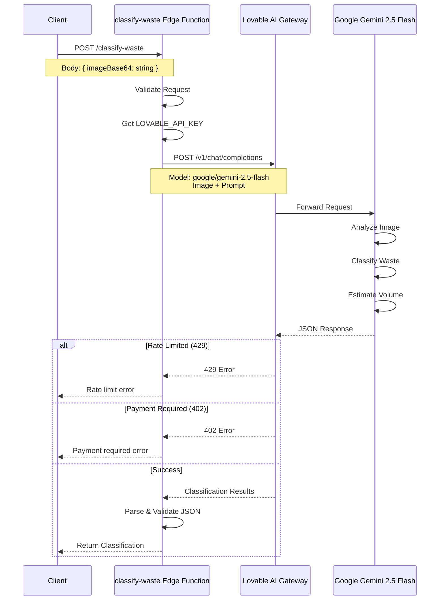
```mermaid
sequenceDiagram
    participant Client
    participant EdgeFn as classify-waste Edge Function
    participant LovableAI as Lovable AI Gateway
    participant Gemini as Google Gemini 2.5 Flash
    
    Client->>EdgeFn: POST /classify-waste
    Note over Client,EdgeFn: Body: { imageBase64: string }
    
    EdgeFn->>EdgeFn: Validate Request
    EdgeFn->>EdgeFn: Get LOVABLE_API_KEY
    
    EdgeFn->>LovableAI: POST /v1/chat/completions
    Note over EdgeFn,LovableAI: Model: google/gemini-2.5-flash<br/>Image + Prompt
    
    LovableAI->>Gemini: Forward Request
    Gemini->>Gemini: Analyze Image
    Gemini->>Gemini: Classify Waste
    Gemini->>Gemini: Estimate Volume
    Gemini-->>LovableAI: JSON Response
    
    alt Rate Limited (429)
        LovableAI-->>EdgeFn: 429 Error
        EdgeFn-->>Client: Rate limit error
    else Payment Required (402)
        LovableAI-->>EdgeFn: 402 Error
        EdgeFn-->>Client: Payment required error
    else Success
        LovableAI-->>EdgeFn: Classification Results
        EdgeFn->>EdgeFn: Parse & Validate JSON
        EdgeFn-->>Client: Return Classification
    end
```

### Classification Categories

The AI classifies waste into these categories:

| Category | Sub-categories | Recyclable |
|----------|---------------|------------|
| **Plastic** | Bottles, bags, containers, wrappers, straws | Yes/No (depends) |
| **Paper** | Cardboard, newspaper, magazines, office paper | Yes |
| **Metal** | Aluminum cans, steel cans, foil, scrap metal | Yes |
| **Glass** | Bottles, jars, broken glass | Yes |
| **Organic** | Food waste, yard waste, biodegradable | Compostable |
| **Electronic** | E-waste, batteries, circuits | Special handling |
| **Hazardous** | Chemicals, medical waste, paint | Special disposal |

---

## Event Management System

### Event Creation Flow

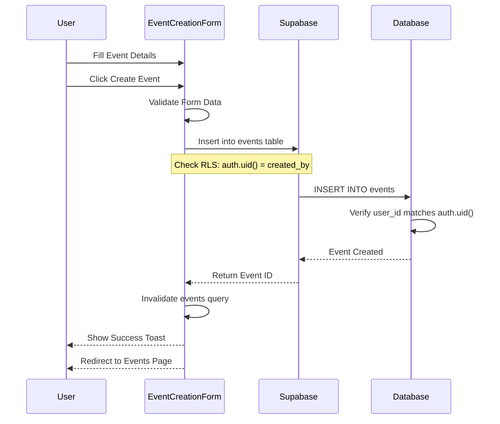
```mermaid
sequenceDiagram
    participant User
    participant EventForm as EventCreationForm
    participant Supabase
    participant Database
    
    User->>EventForm: Fill Event Details
    User->>EventForm: Click Create Event
    
    EventForm->>EventForm: Validate Form Data
    
    EventForm->>Supabase: Insert into events table
    Note over EventForm,Supabase: Check RLS: auth.uid() = created_by
    
    Supabase->>Database: INSERT INTO events
    Database->>Database: Verify user_id matches auth.uid()
    Database-->>Supabase: Event Created
    
    Supabase-->>EventForm: Return Event ID
    EventForm->>EventForm: Invalidate events query
    EventForm-->>User: Show Success Toast
    EventForm-->>User: Redirect to Events Page
```

### Event Participation Flow

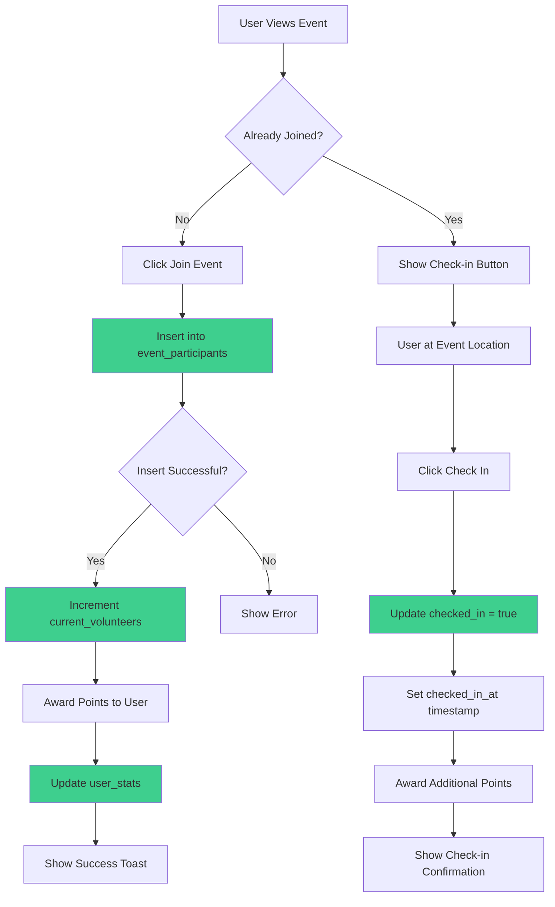
```mermaid
graph TD
    A[User Views Event] --> B{Already Joined?}
    B -->|No| C[Click Join Event]
    B -->|Yes| D[Show Check-in Button]
    
    C --> E[Insert into event_participants]
    E --> F{Insert Successful?}
    F -->|Yes| G[Increment current_volunteers]
    F -->|No| H[Show Error]
    
    G --> I[Award Points to User]
    I --> J[Update user_stats]
    J --> K[Show Success Toast]
    
    D --> L[User at Event Location]
    L --> M[Click Check In]
    M --> N[Update checked_in = true]
    N --> O[Set checked_in_at timestamp]
    O --> P[Award Additional Points]
    P --> Q[Show Check-in Confirmation]
    
    style E fill:#3ecf8e
    style G fill:#3ecf8e
    style J fill:#3ecf8e
    style N fill:#3ecf8e
```

### Event Status Management

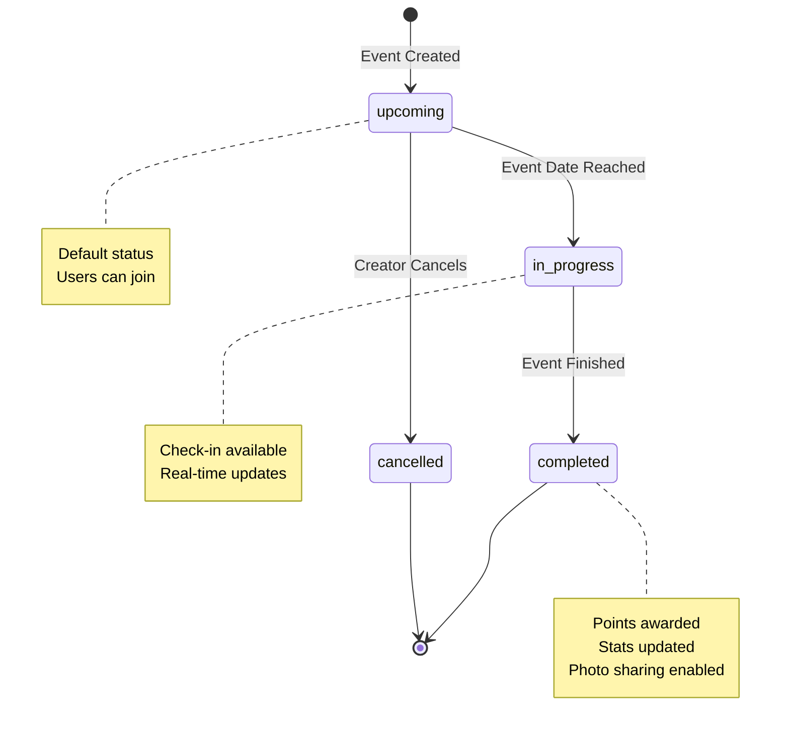
```mermaid
stateDiagram-v2
    [*] --> upcoming: Event Created
    upcoming --> in_progress: Event Date Reached
    upcoming --> cancelled: Creator Cancels
    in_progress --> completed: Event Finished
    completed --> [*]
    cancelled --> [*]
    
    note right of upcoming
        Default status
        Users can join
    end note
    
    note right of in_progress
        Check-in available
        Real-time updates
    end note
    
    note right of completed
        Points awarded
        Stats updated
        Photo sharing enabled
    end note
```

---

## Gamification System

### Points & Leveling System

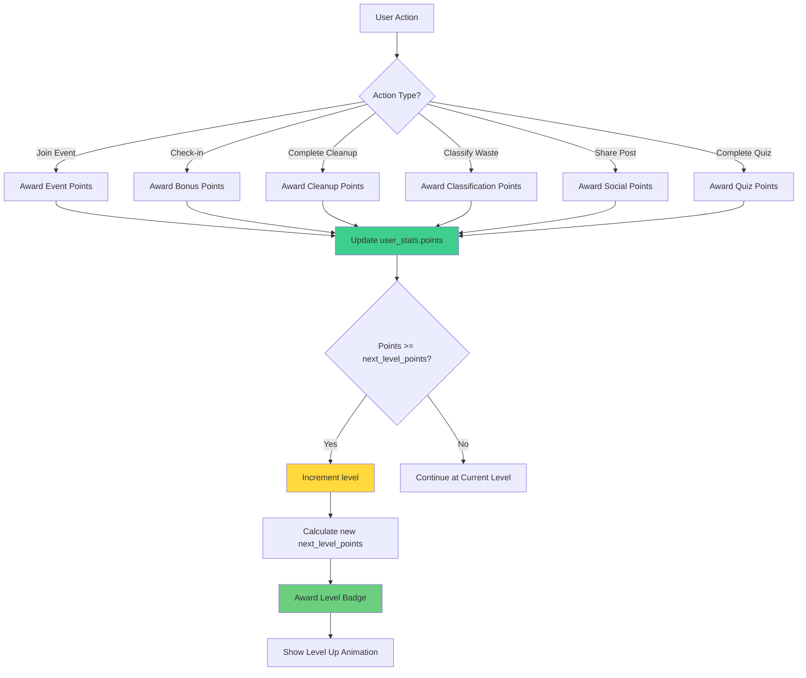
```mermaid
graph TD
    A[User Action] --> B{Action Type?}
    
    B -->|Join Event| C[Award Event Points]
    B -->|Check-in| D[Award Bonus Points]
    B -->|Complete Cleanup| E[Award Cleanup Points]
    B -->|Classify Waste| F[Award Classification Points]
    B -->|Share Post| G[Award Social Points]
    B -->|Complete Quiz| H[Award Quiz Points]
    
    C --> I[Update user_stats.points]
    D --> I
    E --> I
    F --> I
    G --> I
    H --> I
    
    I --> J{Points >= next_level_points?}
    J -->|Yes| K[Increment level]
    K --> L[Calculate new next_level_points]
    L --> M[Award Level Badge]
    M --> N[Show Level Up Animation]
    
    J -->|No| O[Continue at Current Level]
    
    style I fill:#3ecf8e
    style K fill:#ffd93d
    style M fill:#6bcf7f
```

### Achievement System

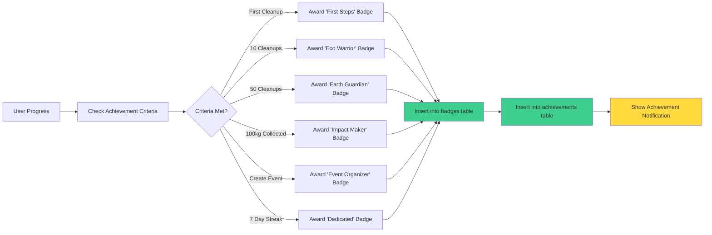
```mermaid
graph LR
    A[User Progress] --> B[Check Achievement Criteria]
    B --> C{Criteria Met?}
    
    C -->|First Cleanup| D[Award 'First Steps' Badge]
    C -->|10 Cleanups| E[Award 'Eco Warrior' Badge]
    C -->|50 Cleanups| F[Award 'Earth Guardian' Badge]
    C -->|100kg Collected| G[Award 'Impact Maker' Badge]
    C -->|Create Event| H[Award 'Event Organizer' Badge]
    C -->|7 Day Streak| I[Award 'Dedicated' Badge]
    
    D --> J[Insert into badges table]
    E --> J
    F --> J
    G --> J
    H --> J
    I --> J
    
    J --> K[Insert into achievements table]
    K --> L[Show Achievement Notification]
    
    style J fill:#3ecf8e
    style K fill:#3ecf8e
    style L fill:#ffd93d
```

### Leaderboard Calculation

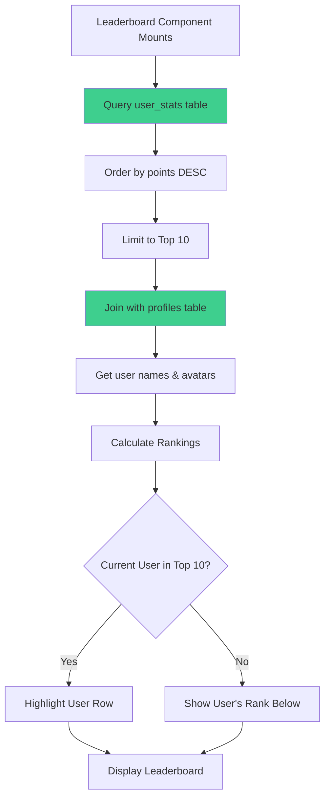
```mermaid
graph TD
    A[Leaderboard Component Mounts] --> B[Query user_stats table]
    B --> C[Order by points DESC]
    C --> D[Limit to Top 10]
    D --> E[Join with profiles table]
    E --> F[Get user names & avatars]
    F --> G[Calculate Rankings]
    G --> H{Current User in Top 10?}
    H -->|Yes| I[Highlight User Row]
    H -->|No| J[Show User's Rank Below]
    I --> K[Display Leaderboard]
    J --> K
    
    style B fill:#3ecf8e
    style E fill:#3ecf8e
```

---

## Real-time Features

### Real-time Event Updates

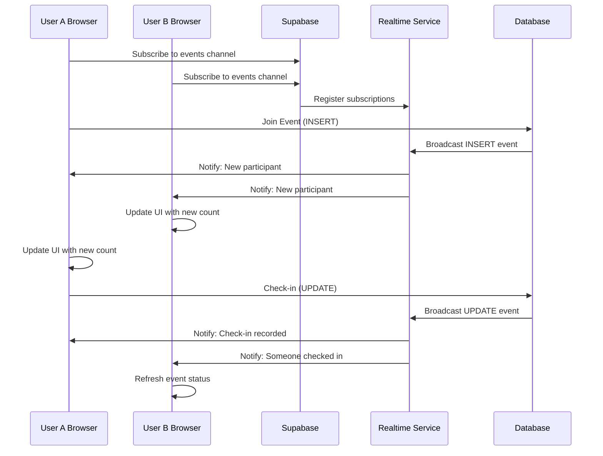
```mermaid
sequenceDiagram
    participant UserA as User A Browser
    participant UserB as User B Browser
    participant Supabase
    participant RealtimeService as Realtime Service
    participant Database
    
    UserA->>Supabase: Subscribe to events channel
    UserB->>Supabase: Subscribe to events channel
    Supabase->>RealtimeService: Register subscriptions
    
    UserA->>Database: Join Event (INSERT)
    Database->>RealtimeService: Broadcast INSERT event
    RealtimeService->>UserA: Notify: New participant
    RealtimeService->>UserB: Notify: New participant
    
    UserB->>UserB: Update UI with new count
    UserA->>UserA: Update UI with new count
    
    UserA->>Database: Check-in (UPDATE)
    Database->>RealtimeService: Broadcast UPDATE event
    RealtimeService->>UserA: Notify: Check-in recorded
    RealtimeService->>UserB: Notify: Someone checked in
    
    UserB->>UserB: Refresh event status
```

### Notification System Flow

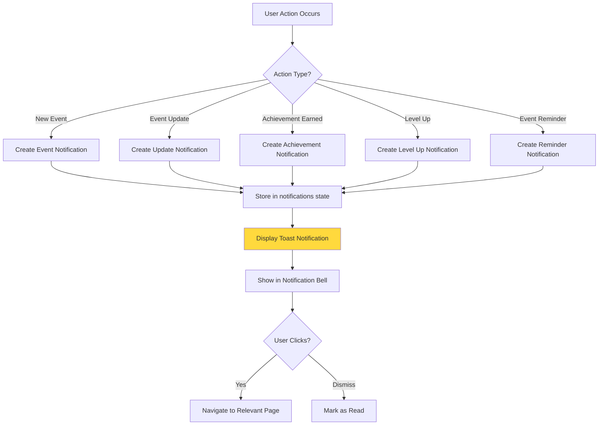
```mermaid
graph TD
    A[User Action Occurs] --> B{Action Type?}
    
    B -->|New Event| C[Create Event Notification]
    B -->|Event Update| D[Create Update Notification]
    B -->|Achievement Earned| E[Create Achievement Notification]
    B -->|Level Up| F[Create Level Up Notification]
    B -->|Event Reminder| G[Create Reminder Notification]
    
    C --> H[Store in notifications state]
    D --> H
    E --> H
    F --> H
    G --> H
    
    H --> I[Display Toast Notification]
    I --> J[Show in Notification Bell]
    J --> K{User Clicks?}
    K -->|Yes| L[Navigate to Relevant Page]
    K -->|Dismiss| M[Mark as Read]
    
    style I fill:#ffd93d
```

---

## Security Implementation

### Authentication Security Flow

```mermaid
graph TD
    A[User Request] --> B{Has Valid Session Token?}
    B -->|No| C[Redirect to /auth]
    B -->|Yes| D[Extract user_id from JWT]
    
    D --> E[Database Query]
    E --> F[Apply RLS Policies]
    F --> G{Policy: auth.uid = user_id?}
    
    G -->|Yes| H[Allow Access]
    G -->|No| I[Deny Access - 403]
    
    H --> J[Return Data]
    I --> K[Return Error]
    
    style D fill:#3ecf8e
    style F fill:#ff6b6b
    style G fill:#ffd93d
```

### Edge Function Security

```mermaid
graph TD
    A[Edge Function Request] --> B[Handle CORS Preflight]
    B --> C{Method = OPTIONS?}
    C -->|Yes| D[Return CORS Headers]
    C -->|No| E[Process Request]
    
    E --> F[Validate Input Data]
    F --> G{Valid Input?}
    G -->|No| H[Return 400 Bad Request]
    G -->|Yes| I[Check Rate Limits]
    
    I --> J{Within Limits?}
    J -->|No| K[Return 429 Too Many Requests]
    J -->|Yes| L[Execute Function Logic]
    
    L --> M{Has Required Secrets?}
    M -->|No| N[Return 500 Internal Error]
    M -->|Yes| O[Process Successfully]
    
    O --> P[Return Response with CORS]
    
    style F fill:#ffd93d
    style I fill:#ff6b6b
    style M fill:#ff6b6b
```

### Row Level Security (RLS) Enforcement

```mermaid
graph LR
    A[Client Request] --> B[Supabase Client]
    B --> C[Include JWT Token]
    C --> D[PostgreSQL Database]
    D --> E[Extract auth.uid from JWT]
    E --> F[Apply RLS Policy]
    
    F --> G{SELECT Policy}
    F --> H{INSERT Policy}
    F --> I{UPDATE Policy}
    F --> J{DELETE Policy}
    
    G --> K{auth.uid = user_id?}
    H --> K
    I --> K
    J --> K
    
    K -->|Yes| L[Execute Query]
    K -->|No| M[Block Query]
    
    L --> N[Return Results]
    M --> O[Return Empty/Error]
    
    style E fill:#3ecf8e
    style F fill:#ff6b6b
    style K fill:#ffd93d
```

---

## Interactive Map System

### Map Component Architecture

```mermaid
graph TD
    A[InteractiveMap Component] --> B[Load India Map Image]
    B --> C[Fetch Events from Database]
    C --> D[Filter by Status = upcoming]
    
    D --> E[Map Events to City Positions]
    E --> F{Event Location Matched?}
    F -->|Yes| G[Calculate Pixel Position]
    F -->|No| H[Skip Event]
    
    G --> I[Render Event Pin]
    I --> J[Show Event Count Badge]
    J --> K[Add Click Handler]
    
    K --> L[User Clicks Pin]
    L --> M[Show Event Details Popup]
    M --> N[Display Event Info]
    N --> O[Show Join Button]
    
    O --> P[User Joins Event]
    P --> Q[Update Database]
    Q --> R[Refresh Map]
    
    style C fill:#3ecf8e
    style Q fill:#3ecf8e
```

**File: `src/components/InteractiveMap.tsx`**

City positions are mapped using percentage-based coordinates:

```javascript
const CITY_POSITIONS = {
  "Mumbai": { x: 26, y: 54 },
  "Goa": { x: 24, y: 62 },
  "Chennai": { x: 52, y: 70 },
  // ... more cities
}
```

### Mapbox Token Edge Function

**File: `supabase/functions/mapbox-token/index.ts`**

```mermaid
sequenceDiagram
    participant Client
    participant EdgeFn as mapbox-token Function
    participant Secrets
    
    Client->>EdgeFn: GET /mapbox-token
    EdgeFn->>Secrets: Retrieve MAPBOX_ACCESS_TOKEN
    Secrets-->>EdgeFn: Return Token
    EdgeFn-->>Client: { token: "pk.ey..." }
```

This edge function securely provides the Mapbox token without exposing it in client-side code.

---

## User Journey Flows

### Complete User Onboarding Journey

```mermaid
journey
    title New User Onboarding Journey
    section Authentication
      Visit Website: 3: User
      Click Sign Up: 4: User
      Enter Details: 4: User
      Verify Email: 5: User
      Auto-login: 5: System
    section First Experience
      View Home Page: 5: User
      See Impact Stats: 4: User
      Browse Events: 4: User
      View Quick Actions: 3: User
    section First Action
      Click AI Classifier: 4: User
      Upload Waste Image: 5: User
      View Classification: 5: User, System
      Learn Disposal Method: 5: User
    section Engagement
      Join First Event: 5: User
      Earn First Points: 5: User, System
      Receive Achievement: 5: User, System
      Check Leaderboard: 4: User
    section Community
      View Social Feed: 4: User
      Share Progress: 5: User
      Get Reactions: 5: User, Community
```

### Event Participation Journey

```mermaid
journey
    title Event Participation Journey
    section Discovery
      Browse Events: 4: User
      Filter by Location: 4: User
      View Event Details: 5: User
      Check Difficulty: 4: User
    section Registration
      Click Join Event: 5: User
      Confirm Participation: 5: User
      Receive Confirmation: 5: System
      Add to Calendar: 4: User
    section Event Day
      Arrive at Location: 5: User
      Check-in via App: 5: User
      Participate in Cleanup: 5: User
      Collect Waste Data: 4: User
    section Post-Event
      Upload Photos: 5: User
      Share Experience: 5: User
      Receive Points: 5: System
      View Impact Stats: 5: User
      Earn Badges: 5: System
```

---

## Performance Optimization

### Code Splitting Strategy

```mermaid
graph TD
    A[App Bundle] --> B[Core Bundle]
    A --> C[Route-based Chunks]
    
    B --> B1[React Core]
    B --> B2[Router]
    B --> B3[Auth Logic]
    B --> B4[Common Components]
    
    C --> C1[Home Page Chunk]
    C --> C2[Events Page Chunk]
    C --> C3[Profile Page Chunk]
    C --> C4[Map Page Chunk]
    C --> C5[AI Classifier Chunk]
    
    C5 --> C5A[Mapbox GL JS]
    C5 --> C5B[Large Dependencies]
    
    style B fill:#61dafb
    style C5 fill:#ff6b6b
```

### React Query Caching Strategy

| Query Key | Stale Time | Cache Time | Refetch On |
|-----------|-----------|-----------|------------|
| `events` | 30s | 5min | Window focus, Mount |
| `user-stats` | 1min | 10min | Mount |
| `profile` | 5min | 30min | Mount |
| `leaderboard` | 30s | 5min | Window focus |
| `social-posts` | 10s | 2min | Window focus |

---

## Error Handling Architecture

### Error Boundary Implementation

```mermaid
graph TD
    A[Component Tree] --> B{Error Occurs?}
    B -->|Yes| C[ErrorBoundary Catches]
    B -->|No| D[Normal Rendering]
    
    C --> E{Error Type?}
    E -->|Network Error| F[Show Retry Button]
    E -->|Auth Error| G[Redirect to Login]
    E -->|Generic Error| H[Show Error UI]
    
    F --> I[Log Error to Console]
    G --> I
    H --> I
    
    I --> J[Display User-Friendly Message]
    
    style C fill:#ff6b6b
    style I fill:#ffd93d
```

**File: `src/components/ErrorBoundary.tsx`**

Catches React rendering errors and displays fallback UI.

---

## Deployment & Build Process

### Build Pipeline

```mermaid
graph LR
    A[Developer Push] --> B[Vite Build]
    B --> C[TypeScript Compilation]
    C --> D[Tailwind CSS Processing]
    D --> E[Asset Optimization]
    E --> F[Bundle Generation]
    F --> G[Deploy to Lovable]
    
    G --> H[Edge Functions Deploy]
    G --> I[Static Assets Upload]
    G --> J[Database Migrations]
    
    J --> K[Run SQL Scripts]
    K --> L[Update RLS Policies]
    L --> M[Verify Deployment]
    
    style G fill:#6bcf7f
    style J fill:#3ecf8e
    style M fill:#ffd93d
```

---

## Key Files Reference

### Critical Files & Their Purposes

| File Path | Purpose | Dependencies |
|-----------|---------|--------------|
| `src/App.tsx` | Root component, routing setup | React Router, Auth |
| `src/hooks/useAuth.ts` | Authentication state management | Supabase Auth |
| `src/components/ProtectedRoute.tsx` | Route protection | useAuth hook |
| `src/components/Layout.tsx` | Page layout wrapper | Navigation, Header |
| `src/integrations/supabase/client.ts` | Supabase client instance | AUTO-GENERATED |
| `supabase/functions/classify-waste/index.ts` | AI waste classification | Lovable AI Gateway |
| `supabase/functions/mapbox-token/index.ts` | Secure token provider | Mapbox API |

---

## Environment Variables

### Required Environment Variables

```bash
# Supabase Configuration (Auto-configured by Lovable Cloud)
VITE_SUPABASE_URL=https://njgnpkqkedwfdzylngdt.supabase.co
VITE_SUPABASE_PUBLISHABLE_KEY=eyJhbGciOiJIUzI1NiIsInR5cCI6IkpXVCJ9...
VITE_SUPABASE_PROJECT_ID=njgnpkqkedwfdzylngdt

# Edge Function Secrets (Server-side only)
LOVABLE_API_KEY=************ (auto-provided)
MAPBOX_ACCESS_TOKEN=************ (manually configured)
SUPABASE_SERVICE_ROLE_KEY=************ (auto-provided)
SUPABASE_DB_URL=************ (auto-provided)
```

---

## Summary

This documentation covers the complete architecture of Eco-Sanjivani, including:

✅ **System Architecture** - High-level overview and technology stack  
✅ **Authentication Flow** - User login, signup, and protected routes  
✅ **Database Design** - ER diagrams, RLS policies, and relationships  
✅ **Component Structure** - React component hierarchy  
✅ **Routing System** - All routes and navigation  
✅ **Data Management** - React Query patterns and mutations  
✅ **AI Classification** - Waste classification system architecture  
✅ **Event System** - Event creation, participation, and management  
✅ **Gamification** - Points, levels, badges, and achievements  
✅ **Real-time Features** - Live updates and notifications  
✅ **Security** - Authentication, RLS, and edge function security  
✅ **Map System** - Interactive map implementation  
✅ **User Journeys** - Complete user experience flows  

For any questions or clarifications about specific components or flows, refer to the relevant section above or check the source code files referenced throughout this documentation.